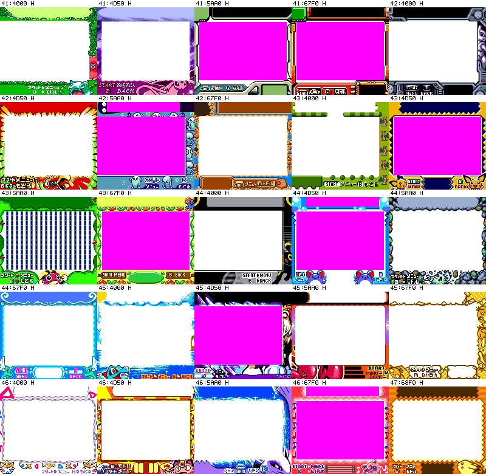
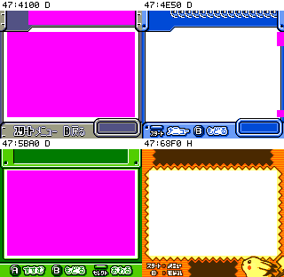

# Pokémon graphic windows and name-table limits

## Byte facts and model provenance

Bank 53:4000 contains 25 little-endian pointers (50 bytes) followed by25 Shift-JIS/NUL strings (319 bytes), ending4171. Own decode/reemit reproduces all 369 bytes. The maintained table/header's “no reader found” is a finite historical statement, not proof of no computed reader.

The bank 41–46 loop describes24 physical windows of stride 0D50. A further window47:68F0–7640 has 2560 tile bytes, 360 tilemap bytes at72F0,360 attributes at7458 and 128 palette bytes at75C0. Its current editable PNG already exists: `gfx/browser/frames_2_3/tilemap_72f0.screen.png`. All 360 cells select bank 1 with tile number below 128; the declared 160-unsigned and 128-signed models select the same byte/palette sources for every cell, and the existingPNG matches the own model in all 23,040 RGB pixels. This proves conditional composition identity, not an executed loader.

The 27-style table4E:654B selects five 31-byte descriptors but only three distinct sets of five far pointers, all in bank 47 (record starts4100/4E50/5BA0). It does not select 68F0, point into bank 41–46 or reference the bank 53 name table. The physical fourth record remains HYPOTHESIS. Its visual identity remains unproved; no species name or image/name mapping is adopted from visual resemblance. The counts 25 names and 24+1 windows neither establish a bijection nor shared order.

## Locator-only contacts

The first 24 cards use the 160-tile editing model, with unresolved cells pink. The last card is 47:68F0. Card order is address order, not name-table order or a menu order.

D marks the first three windows selected by maintained descriptors; H marks 47:68F0, outside that table. These images use the 128 BG signed/menu/32OBJ model; unprovided cells are pink. D describes static pointer/load provenance, not CONFIRMED natural reachability.

## Name-table order, no image assignment

| index | address | Shift-JIS text | image assignment |
|---:|---|---|---|
|0|53:4032|　　ポリゴン|unproved|
|1|53:403F|　ピカチュウ|unproved|
|2|53:404C|　　トゲピー|unproved|
|3|53:4059|　　ニャース|unproved|
|4|53:4066|　　ルギア|unproved|
|5|53:4071|　　プリン|unproved|
|6|53:407C|　　ワニノコ|unproved|
|7|53:4089|　　エンテイ|unproved|
|8|53:4096|　　ハッサム|unproved|
|9|53:40A3|　　コダック|unproved|
|10|53:40B0|　ブラッキー|unproved|
|11|53:40BD|　　マリル|unproved|
|12|53:40C8|　バンギラス|unproved|
|13|53:40D5|　ハクリュー|unproved|
|14|53:40E2|　ウソッキー|unproved|
|15|53:40EF|　　ピチュー|unproved|
|16|53:40FC|　　レディバ|unproved|
|17|53:4109|　キレイハナ|unproved|
|18|53:4116|　ミュウツー|unproved|
|19|53:4123|　　ホウオウ|unproved|
|20|53:4130|　ソーナンス|unproved|
|21|53:413D|　　ディグダ|unproved|
|22|53:414A|　フシギバナ|unproved|
|23|53:4157|　　エーフィ|unproved|
|24|53:4164|　ポリゴン２|unproved|

## Finite consumer confrontation

Own 343 ASM + 5 INC source scan finds Table_53_4000 only at its definition; String_53_4032 occurs at its definition and the first dw in the same table. No BANK expression of a current bank 53 symbol was found. Six literal `ld a,$53` sites immediately store to hTextY (account/confirm_screens:514) or wSpriteSlot2 (browser/page_list:685/880/894/2216/2578); those six instructions do not select ROM bank 53. Three adjacent exact ROM patterns2100403e53,3e53210040,004053 had zero matches. These observations cover only their stated source/symbol/pattern scope. They do not exclude arithmetic, delayed bank changes, computed pointers, runtime copying or unobserved paths. No missing callergraph was reconstructed and no new natural scenario was captured.

Keep image/name assignment, purpose of unused layouts and natural reachability HYPOTHESIS. A missing preview, fragmentary tile extraction or absent literal pattern must not be promoted to a missing ROM resource. All 947 active assets already reproduce original bytes; this audit changes only documentation and the two explanatory contacts. Actual integration, later publication and any new runtime evidence are separate ROOT operations.
