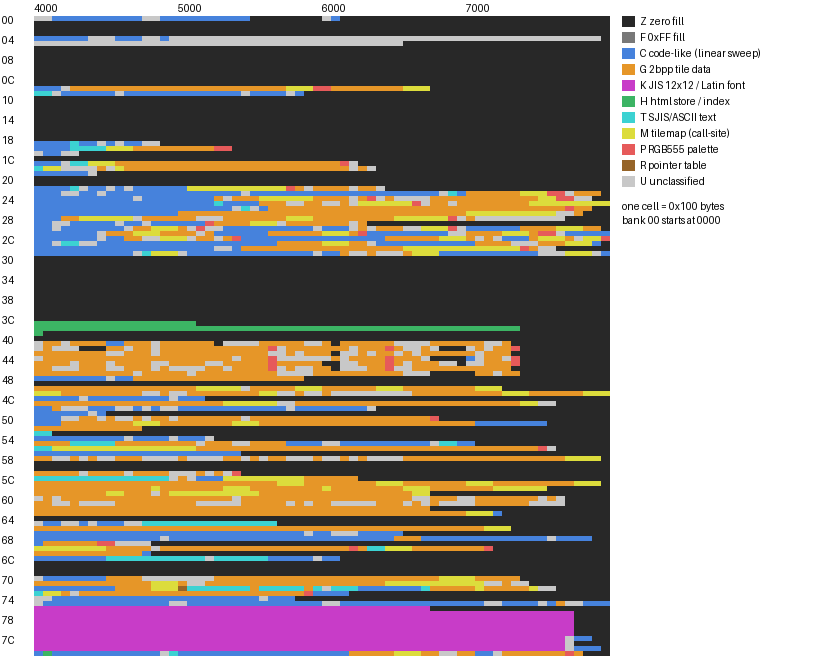

# Bank survey (generated by `tools/survey.py`)

Systematic content survey of every 16 KiB bank of `baserom.gbc`. All coordinates are CPU addresses (bank 00 = 0000-3FFF, banks 01-7F = 4000-7FFF; file offset = bank*0x4000 + (addr & 0x3FFF)). Machine-readable results: `analysis/bank_survey.json`, `analysis/strings.tsv`, `analysis/gfx_candidates.tsv`, `analysis/proposals/survey_regions_bankNN.tsv`. Re-run with `python3 tools/survey.py` (needs `baserom.gbc`, Pillow for the images).

Evidence vocabulary: **CONFIRMED** = demonstrated by cited bytes/disassembly; **PROBABLE** = strong evidence, not conclusive; **HYPOTHESIS** = interpretation not yet confirmed. Heuristic classifications (code-likeness, tile coherence) are never better than PROBABLE; after adversarial review heuristic tile blocks need >= 32 coherent tiles for PROBABLE and heuristic proposals are trimmed against recursively-proven code.



## 1. Headline findings

| # | finding | status | evidence |
|---|---|---|---|
| 1 | **Far-call helper**: `call $06D1` is followed by 3 inline bytes `dw target, db bank`; it switches ROM bank and jumps. There are 5274 such call sites with 439 distinct (bank,target) pairs, so most inter-bank control flow is `call $06D1`. | CONFIRMED | disassembly 00:06D1-00:06FC (pops the return address, reads 3 bytes with `ld a,[hli]` into FFAE/FFAF/FFF2, `call $0622` = bank switch, `call $FFA8` into a RAM stub; the RAM stub itself is not in the ROM); byte scan of the whole ROM |
| 2 | **Text is Shift-JIS**: double bytes (lead 81-9F, E0-EF, F8-F9) + single bytes 20-7F; controls < 0x20. 707 strings recovered (255 CONFIRMED). | CONFIRMED | text engine 00:0ED3 (lead-byte test at 00:0F31), decoded strings in `analysis/strings.tsv`; see `docs/research/text_encoding.md` |
| 3 | **Font**: banks 76-7E hold a JIS X 0208 12x12 1bpp font (18 bytes/glyph, 9 JIS rows per bank, 94 columns per row, no compression) and a 6x12 Latin font at 76:67A8 (96 glyphs x 12 bytes). Layout re-derived from the ROM tables at 7F:40F9/7F:4150. | CONFIRMED | routines 7F:400E, 7F:4072, 7F:40B9; bank sizes match exactly (9x94x18 = 0x3B7C; 6x94x18 = 0x27A8, + 96x12 = 0x480 gives 0x6C28, and the last non-zero byte of bank 76 is 6C26; banks 77-7B end exactly at 7B7C, the first byte after that being 00); rendered sheets `img/font_jis_rows_01-08.png`, `img/font_latin_6x12.png` |
| 4 | **Built-in web pages**: banks 3D/3E store 55 HTML files as `name\0`, u16 length, Shift-JIS body; bank 3F holds a table of far pointers (addr16, bank) to all of them plus `file://di/`. | CONFIRMED | records chain exactly to the padding (3D ends at 518C, 3E at 75CF); all 55 index entries equal parsed record starts |
| 5 | **VRAM tile loads are raw**: `call $06D1 ; dw $0787 ; db 00` programs HDMA directly from ROM (bank a, HL) to VRAM (DE) for C x 16 bytes. 272 ROM-to-VRAM blocks and 115 tilemap loads were recovered from call-site immediates; the data is uncompressed 2bpp. | CONFIRMED | disassembly 00:0787-07C9 (writes FF51-FF55); register immediates recovered by `tools/extract_gfx.py` |
| 6 | **Tilemap loader**: `call $06D1 ; dw $08EA` copies B rows x C columns (WRAM stride 0x20) of tile IDs and then a second B*C block (attributes, WRAM +0x400) from bank a, HL. Screens are typically 20x18. | CONFIRMED | disassembly 00:08EA-0903 |
| 7 | **No compressed graphics demonstrated.** A pokecrystal-LZ probe over every offset gives 1822 hits, 1559 of them inside data proven raw or in the font, i.e. the probe is not distinctive (it parses uncompressed tile data). The only loader seen (HDMA) copies raw bytes. | PROBABLE (absence) | `--lz-probe` in `tools/extract_gfx.py`, section 6 below |
| 8 | **Bank 00 palette block** 00:0352-0391 = 32 x `$7FFF` (white), loaded to BG and OBJ palette RAM at boot. | CONFIRMED | `ld hl,$0352` at 00:0335 and 00:0341, `ld c,$69` / `ld c,$6B`, `call $034A` at 00:033A / 00:0346; $034A copies 64 bytes through `ldh [c],a` to the palette data port |
| 9 | Bank 04 code at 04:4056-407F initialises the APU (NR52=$80, NR51, NR12/NR17/NR21, NR14/NR19/NR23, NR50=$77), so bank 04 very likely holds the sound driver. The earlier claim that banks 04/05 contain *sound bytecode* is only a HYPOTHESIS and is contradicted for part of bank 05: 05:63B0-63F0 mixes command-like bytes with Shift-JIS pairs (`81 47 81 4F 81 57 ...`), i.e. UI/script data. | PROBABLE (bank 04 sound init) / HYPOTHESIS (bytecode) | disassembly 04:4056-407F (`ldh [$FF26],a` ... `ldh [$FF24],a`); hexdump 05:63B0 |
| 10 | Serial registers are accessed by bank 75 code: 75:5B2B-5B45 loads a byte, `ldh [$FF01],a`, then `ldh [$FF02],a` with $03 and $83 (start transfer), and 75:5F20 polls SC bit 7; bank 00 reads SC once (00:0207). Bank 75 also holds SMTP/HTTP keyword strings (`MAIL FROM:<`, `Content-Length:`, `WWW-Authenticate: GB00 name="`). That this is the Mobile Adapter link is an interpretation. | CONFIRMED (register accesses) / PROBABLE (Mobile Adapter link) | disassembly 75:5B2B-5B45, 75:5F1F-5F25; byte scan of `f0/e0 01|02` in banks 00 and 75; strings in `analysis/strings.tsv` |

## 2. Method (what each column means)

* **Windows / blocks**: every bank is analysed in 4 windows of 0x1000 bytes (`windows` in the JSON) and 64 blocks of 0x100 bytes (`block_map`).
* **Fill runs**: runs of 0x00 / 0xFF of >= 32 bytes (`zero_runs_ge32`, `ff_runs_ge32`). Byte-level facts (CONFIRMED as fills; whether they are *padding* is an interpretation).
* **Entropy**: Shannon entropy of the byte histogram.
* **Code-likeness**: linear SM83 sweep with `tools/sm83.py`; per window/block the fraction of illegal opcodes, the density of `ret/jp/jr` terminators, the fraction of absolute `call/jp` targets that are valid (ROM0 instruction starts, in-bank instruction starts, WRAM C000-DFFF, HRAM) and a log-likelihood ratio (`llr`, bits/instruction) of the opcode stream against an opcode model trained on the bank-00 code stream. Classification "code-like" needs llr > 0.35, < 3% illegal opcodes, > 60% valid branch targets and no 2bpp-tile coherence.
* **2bpp tile-likeness**: fraction of horizontally / vertically adjacent pixel pairs that are equal (`hsim2`, `vsim2`; random data ~0.25-0.3, code ~0.35-0.4, artwork 0.55-0.9) plus a 1bpp variant; tile blocks are found per bank by tile-level coherence (>= 8 tiles).
* **Pointer tables**: little-endian words in 4000-7FFF forming runs of >= 5 distinct entries (stride 2; strides 3-8 are searched but only stride 2 is reported), accepted only when >= 90% of targets are inside the used part of the bank and either strictly ascending (>= 95%) or >= 70% of targets are on a decoded string start / after a NUL. Overlaps with tile data or known structures are dropped. Verifier additions: a leading entry that is the operand of a preceding jp/call is dropped; a table whose entry 0 (the lowest target) lies 2k bytes ahead with k >= 5 is truncated to k entries; a table is PROBABLE only with >= 80% string-start targets, an `ld hl/de/bc,<table>` reference in the bank, a regular stride, or a hand-verified dispatch (`VERIFIED_TABLES`); `DROPPED_TABLES` lists retractions.
* **Palettes**: 4-word groups with bit 15 clear, >= 3 distinct values, containing $7FFF and monotone luminance (chance < 1e-5 per offset); consecutive groups form runs.
* **Record detection**: byte-equality autocorrelation for strides 2-96 (`stride` per window in the JSON). Example: bank 72 message records (mostly 69-byte stride, some 102) show up here.
* **Strings**: see `docs/research/text_encoding.md`.

## 3. Per-bank map

Legend: `Z` zero fill, `F` 0xFF fill, `C` code-like (linear sweep), `G` 2bpp tile data, `K` JIS 12x12 / Latin font, `H` html store / index, `T` SJIS/ASCII text, `M` tilemap (call-site), `P` RGB555 palette, `R` pointer table, `U` unclassified. Each map character is one 0x100-byte block (first char = 4000 or 0000).

```
bank used-end  zero% ff%  H    map(64 blocks)
00   2183       65    0  3.40 UUCCCCCCCCCCUUCCCCCCCCCCZZZZZZZZUCZZZZZZZZZZZZZZZZZZZZZZZZZZZZZZ
04   7E8C        6    1  6.89 CCCCCCUUUCCCUUCUUUUUUUUUUUUUUUUUUUUUUUUUUUUUUUUUUUUUUUUUUUUUUUUZ
05   68C3       37    0  5.00 UUUUUUUUUUUUUUUUUUUUUUUUUUUUUUUUUUUUUUUUUZZZZZZZZZZZZZZZZZZZZZZZ
0E   6BB0       55    7  3.92 CCCUGGGGGGGGGGGGGGGGGGGGGGGGMMMPPGGGGGGGGMMMZZZZZZZZZZZZZZZZZZZZ
0F   5DAE       55    0  4.03 TTUCCCCCCUCCCCCCCCCCCCCUCCCCUCZZZZZZZZZZZZZZZZZZZZZZZZZZZZZZZZZZ
19   4D99       80    0  2.00 CCCCTCCUCUCCUUZZZZZZZZZZZZZZZZZZZZZZZZZZZZZZZZZZZZZZZZZZZZZZZZZZ
1A   55D4       72    2  2.72 CCCCTTTTMMMGGGGGGGGGPPZZZZZZZZZZZZZZZZZZZZZZZZZZZZZZZZZZZZZZZZZZ
1B   446B       94    0  0.73 UCCUUZZZZZZZZZZZZZZZZZZZZZZZZZZZZZZZZZZZZZZZZZZZZZZZZZZZZZZZZZZZ
1C   4033      100    0  0.04 ZZZZZZZZZZZZZZZZZZZZZZZZZZZZZZZZZZZZZZZZZZZZZZZZZZZZZZZZZZZZZZZZ
1D   63BA       53    7  4.07 CCCUTTMMMGGGGGGGGGGGGGGGGGGGGGGGGGPUZZZZZZZZZZZZZZZZZZZZZZZZZZZZ
1E   658B       52    5  4.22 TMMUUUUGUMGGGGGGGGGGGGGGGGGGGGGGGGGUGUZZZZZZZZZZZZZZZZZZZZZZZZZZ
1F   4667       90    0  1.06 CCCCCCUZZZZZZZZZZZZZZZZZZZZZZZZZZZZZZZZZZZZZZZZZZZZZZZZZZZZZZZZZ
22   66CF       47    2  4.66 CCCCTUCCUCUCCCCCCMMMMMMMMMMMPGUGGGGUGGUZZZZZZZZZZZZZZZZZZZZZZZZZ
23   7F30        7    4  6.43 CCCUUCCUCCCCCCCCCCCCCCCUCCCCCCCCCCCCCCCCCCCCCUTCGGGGGGMMMPPUGGGZ
24   7D48       20    5  6.33 CCCCCCCCCCCUCCCCCCCCGUGGGMMMMMMGGGGUGPUGUUUUGGGGGGGGGGGGMMPPUUZZ
25   7FA0       15    6  6.53 CCCCCCCCCCCCCCCCCCCCTCCCCGGGUUGGUUGUMMMMMMPUGGUGGGGGGGGMMMMMMMMM
26   7D41       25    5  5.93 CCCCCCCCCCCCCCCCCCCCCCUTUCGGGGGGGGGGGGGGGGGGGGGGGGGGGGGGGGGPGGZZ
27   7CE4       22    6  5.94 CCCCCCCCCCCCCCCCGGGGGGGGGGGGGGGGGGGGGGGGGGGGGGGGMMMMMMMMMMUUGZZZ
28   7A5D       32    5  5.71 CCCGGMMMMMMUGGGGGGUUUGGGGGGGMMMGGGGGGGGGMMMMMMPUGUUUUUUUUUUZZZZZ
29   64F4       50    4  4.36 CCUUCCCCCUCCUCCCCCCPGGGGMMMUGGGGGGGUGZZZZZZZZZZZZZZZZZZZZZZZZZZZ
2A   7E78       16    4  6.49 CCUCCCCCCCUGGMMMGUPUUCCCCCCCCCCUCCCUGUGGGUUMMMPUCCCCCCGGGGMMMGGZ
2B   7F44       13    4  6.68 CCCCCCCUGGGMMMGGGGUGCCCCCCGGGGGGMMMGPCCCCCCCCCUUGGGGMMMGPPUCCCCC
2C   7FD0       16    3  6.43 CCCCCCCUCCGGUUMMMUGGUGPCCCCCCCCCCCCCCCCGGGGGGMMMGUGUCCCGMMMGUMMP
2D   7ECD       15    3  6.61 CCUTTUUCCCCCCCCCCCCCCCCCCCCGGGGGMMMGGUCCCCCCCCCCCGGGGUUUGGGMMMCZ
2E   7961       25    5  6.06 CCCCCCCCCCCCCCCCCCCCUUCGGGGGGGGGGGGGGGGGGMMMMMMMMMMMMMPGUUZZZZZZ
2F   7FAC        9    3  6.76 CCCCCCCCCCCUTMMMUCCCCCCCCCCCCCCUCCGUUGUUUGMMMCCCCCCCCCCCUUUMMMUC
3D   518B       73    0  2.37 HHHHHHHHHHHHHHHHHHZZZZZZZZZZZZZZZZZZZZZZZZZZZZZZZZZZZZZZZZZZZZZZ
3E   75CE       17    0  5.39 HHHHHHHHHHHHHHHHHHHHHHHHHHHHHHHHHHHHHHHHHHHHHHHHHHHHHHZZZZZZZZZZ
3F   410C       98    0  0.22 HZZZZZZZZZZZZZZZZZZZZZZZZZZZZZZZZZZZZZZZZZZZZZZZZZZZZZZZZZZZZZZZ
41   753E       47    7  4.49 UGGUGGGGCCGGGUGGGGGGZUUUUGGGGGUUGZGGGGGGUUUUGGGGGGUUGZZZZZZZZZZZ
42   753D       42    6  4.75 UGUUUZZZGGUGGUGGGGGGGGGGGGPUGGGGGGGUGGGPGUUGUZZZUGUGGPZZZZZZZZZZ
43   7540       53    5  4.07 GGGGGGGGUUGGGUGGGGGGGGGGGGUUGUGGGZUUGUGGUGUGGGGGGUGGGZZZZZZZZZZZ
44   7540       42   11  4.48 UGGGGGGGGGGGGGGGGGGGGGUGGGPUUUUUUGUGGGGPGGGUZZZZCUGGUPZZZZZZZZZZ
45   753D       43    7  4.69 GGGGUGGGUGGGGUUGGGGUUGGGGGPGGGGGZZUUGGGPGUGGGUUZUUGGGPZZZZZZZZZZ
46   7540       44    8  4.58 GGUUUGGGUUGGGUGUUUUGGUGGGGPUGUUGGZUUUGGPUUGGGGGGGGGGGZZZZZZZZZZZ
47   763E       59    5  3.46 GGGGGGGGGGGUGGGGGUGGGGGGGGGUUUUGGGGGGGGGGUUUZZZZZGGUGGZZZZZZZZZZ
48   5DC9       68    1  3.05 CCCCCCCCUCCGGGGGGGGGGGGGGGGGGGZZZZZZZZZZZZZZZZZZZZZZZZZZZZZZZZZZ
4A   7378       35   10  5.21 GGGGGGGGGGGGGGGGGGMMMMMUGGGGGMMMGGGGGGMMMGGGGGGGGMMMZZZZZZZZZZZZ
4B   7FE0       17   18  5.97 MMMGGGGGGGGGUUGUUGGGGGGGGMMUUGUUGUUUUUUUUUGGGGGGGGGGMMMGGGGGGMMM
4C   52DF       72    0  2.67 CCCCCUCCCCCCCCCUCCCZZZZZZZZZZZZZZZZZZZZZZZZZZZZZZZZZZZZZZZZZZZZZ
4D   7983       31   14  5.29 GGGGGGGGGGGGGGGGGGGGGMMMMMMUUGGGGGGGGGGGGGGGGGGGGGGGGGMMUUZZZZZZ
4E   661C       45    1  4.79 CCGUUUCCCUUCUCUUCCCCCCCCCCCCUCCCCCCCCUZZZZZZZZZZZZZZZZZZZZZZZZZZ
4F   47FD       88    0  1.28 CCCCCCUCZZZZZZZZZZZZZZZZZZZZZZZZZZZZZZZZZZZZZZZZZZZZZZZZZZZZZZZZ
50   6D1E       46    6  3.90 CCCUUGGUGUUGUGGUGGGGGGGUGGGGGGGGGGGGGGGGGGGGPZZZZZZZZZZZZZZZZZZZ
51   7900       45   11  4.46 CCCGGGGGGGGMMMGGGGGGGGMMMGGGGGGGGGGGGGGGGGGGGGGGGCCCCCCCCZZZZZZZ
52   4BFF       89    8  0.77 GGGGGGGGGGGGZZZZZZZZZZZZZZZZZZZZZZZZZZZZZZZZZZZZZZZZZZZZZZZZZZZZ
53   4170       98    0  0.23 TTZZZZZZZZZZZZZZZZZZZZZZZZZZZZZZZZZZZZZZZZZZZZZZZZZZZZZZZZZZZZZZ
54   53E9       71    0  2.83 CCCCCCCCCCUCCCCUCCCUZZZZZZZZZZZZZZZZZZZZZZZZZZZZZZZZZZZZZZZZZZZZ
55   7082       46    1  4.80 GGGGTTTTTGGGGGGGGGUGGGUUGGGGCCCCUUCCCCCCCCCCUTTCCZZZZZZZZZZZZZZZ
56   79D0       32    8  5.33 TTMMMMMMMMMMMMMMMMGGGGGGGGGGGGGGGGGGGGGGGGGGGGGGGGGGGGGGPUZZZZZZ
57   5641       68    0  2.97 CCCCCCCCCCCCCCCCCCCCCCCZZZZZZZZZZZZZZZZZZZZZZZZZZZZZZZZZZZZZZZZZ
58   7EA0       27   19  5.36 GGUUGUGUUGGGUUUUGUUUUGGUGUGGUUUGUUGUGUUUUGGGGGGGGGGGGGGGGGGMMMMZ
5B   56E0       68   12  2.59 GGGGGUGGGGUGGGGUUUGUGUPZZZZZZZZZZZZZZZZZZZZZZZZZZZZZZZZZZZZZZZZZ
5C   642F       52    1  4.10 TTTTTTTTTTTTTTTUGUCCCMMMMMMMMMGGGGGGZZZZZZZZZZZZZZZZZZZZZZZZZZZZ
5D   7E70       24   20  5.32 GGGGGGGGGGGGGGGGGGGGGGGGGGGMMMGGGGGGGGMMMGGGGGGGMMMGGGGGGGGGMMMZ
5E   78A0       32   20  4.77 GGGGGGGGGGGGGMGGGGGGGMMMGGGGGGGGMGGGGGGGGMMMGGGGGGGMMMMMMZZZZZZZ
5F   6BCE       52   12  3.48 GGGGGGGGMMGGGUGMMMMMMMMMMGGGGGGGGGGGGGGGGGMMZZZZZZZZZZZZZZZZZZZZ
60   7AE8       18   33  4.89 UGUGGGGGGGGGGGGGGGGGGGUGGGGGGGGGGGGGGGGGGGUUGGGUUGGGGGGGUGUZZZZZ
61   7AE8       17   35  4.88 GGUUGUUUUGGGGGGGGGUUUUUGGGGGUGUGGUUUUUGGGUGUGUUUUGGGGGGUUUUZZZZZ
62   6C00       47   31  2.82 GGGGGGGGGGGGGGGGGGGGGGGGGGGGGGGGGGGGGGGGGGGGZZZZZZZZZZZZZZZZZZZZ
63   742F       72   11  2.33 GGGGGGGGGGGGGGGGGGGGGGGGGGGGGGGGGGGGGGGGGGGGGGGGMMMCZZZZZZZZZZZZ
65   5A8C       60    0  3.64 UCCUUCUCCCUUTTTTTTTTTTTTTTTZZZZZZZZZZZZZZZZZZZZZZZZZZZZZZZZZZZZZ
66   74B8       34   38  3.41 GGGGGGGGGGGGGGGGGGGGGGGGGGGGGGGGGGGGGGGGGGGGGGGGGGMMMZZZZZZZZZZZ
67   685F       40    0  4.88 CCCCCCCCCCCCCCCCCCCCCCCCCCCCCCUCCUUUCCCCCZZZZZZZZZZZZZZZZZZZZZZZ
68   7D8D       14    1  6.14 CCCCCCCCCCCCCCUCCCCCCCCCCCCCCCCCCCCCCCCCGGGCCCCCCCCCCCCCCUCCCCZZ
69   4C46       87    0  1.31 CGGGGGGPPUUUUZZZZZZZZZZZZZZZZZZZZZZZZZZZZZZZZZZZZZZZZZZZZZZZZZZZ
6A   72BF       31   11  5.11 MMMMMMMMGGGGGUGGGGGGGGGGGGGGGGGGGGGPGTTMMMGGGGGGGGPZZZZZZZZZZZZZ
6B   4D20       90    0  1.00 GGGGGGGGGGGGCZZZZZZZZZZZZZZZZZZZZZZZZZZZZZZZZZZZZZZZZZZZZZZZZZZZ
6C   61CB       49    1  4.54 CCCCCCCCTTTTTTTTTTTUTTTTTTCCCCCUCCZZZZZZZZZZZZZZZZZZZZZZZZZZZZZZ
70   7590       28    6  5.56 UCCCCCCCGGGGUUUUUUUUGGGGGGGGGGGGGGGGGGGGGGGGGMMMMGGGGGZZZZZZZZZZ
71   7740       26   16  5.31 GGGGGGGGGGGGGMMMGUUGGGGGGGGGGGGGGGGGGGGMMMMMMMMMMMUUGUUZZZZZZZZZ
72   7A1F       21    3  5.69 CCCCCCCCCGGGGMMMRTTTTTTTGTTTTTGTUTTTCCCCCCCTGGGGGMGGGGGMUUZZZZZZ
73   62EF       64    6  3.25 TMMGUGGGGGGGGGGGGGGGGGGGGGGGGGPCCCCZZZZZZZZZZZZZZZZZZZZZZZZZZZZZ
74   5C61       57    0  3.96 UUCCCCCCCCCCCCCCCCCCCCCCCUCCCZZZZZZZZZZZZZZZZZZZZZZZZZZZZZZZZZZZ
75   7F46        4    0  6.90 UCCCCCCCCCCCCCCUUCCCCCCCCCCCCCCCUUCCCCCCCCCCCCCCCCUUCCCCUCGUUCCC
76   6C27       46    1  4.79 KKKKKKKKKKKKKKKKKKKKKKKKKKKKKKKKKKKKKKKKKKKKZZZZZZZZZZZZZZZZZZZZ
77   7B7B       14    2  6.66 KKKKKKKKKKKKKKKKKKKKKKKKKKKKKKKKKKKKKKKKKKKKKKKKKKKKKKKKKKKKZZZZ
78   7B7B       14    2  6.62 KKKKKKKKKKKKKKKKKKKKKKKKKKKKKKKKKKKKKKKKKKKKKKKKKKKKKKKKKKKKZZZZ
79   7B7B       14    2  6.47 KKKKKKKKKKKKKKKKKKKKKKKKKKKKKKKKKKKKKKKKKKKKKKKKKKKKKKKKKKKKZZZZ
7A   7B7B       19    2  6.27 KKKKKKKKKKKKKKKKKKKKKKKKKKKKKKKKKKKKKKKKKKKKKKKKKKKKKKKKKKKKZZZZ
7B   7B7B       14    2  6.47 KKKKKKKKKKKKKKKKKKKKKKKKKKKKKKKKKKKKKKKKKKKKKKKKKKKKKKKKKKKKZZZZ
7C   7E11       11    2  6.64 KKKKKKKKKKKKKKKKKKKKKKKKKKKKKKKKKKKKKKKKKKKKKKKKKKKKKKKKKKKUCCZZ
7D   7C12       14    2  6.55 KKKKKKKKKKKKKKKKKKKKKKKKKKKKKKKKKKKKKKKKKKKKKKKKKKKKKKKKKKKUZZZZ
7E   7EB3       49    0  4.06 KKKKKKKKKKKKKKKKKKKKKKKKKKKKKKKKKKKKKKKKKKKKKKKKKKKKKKKKKKKUCCCZ
7F   7CC5       18    3  6.44 CHCCCCCCCCCCCCUTCCCCCCCCCCCCCCCCCCCGGGGGMMMGGUUGGCCUGGGGGGGPGZZZ
```

Empty banks (entirely 0x00): 01 02 03 06 07 08 09 0A 0B 0C 0D 10 11 12 13 14 15 16 17 18 20 21 30 31 32 33 34 35 36 37 38 39 3A 3B 3C 40 49 59 5A 64 6D 6E 6F (43 banks). Non-empty: 85 banks.

| bank | used end | byte classes (>=5%) | strings (C/P/H) | tables | palettes | notes |
|---|---|---|---|---|---|---|
| 00 | 2183 | Z 63%, C 31%, U 6% | 0/0/0 | 0 | 1 | reset/interrupt vectors, text engine (0ED3), far-call helper (06D1), HDMA/tilemap loaders (0787/08EA), boot palette 0352 |
| 04 | 7E8C | U 82%, C 16% | 0/0/0 | 1 | 0 | APU init at 4056 => probable sound driver (PROBABLE); rest unclassified |
| 05 | 68C3 | U 63%, Z 36% | 0/0/12 | 0 | 0 | unclassified; 63B0 mixes commands with SJIS pairs (not proven sound data) |
| 0E | 6BB0 | G 51%, Z 32%, M 9% | 0/0/0 | 1 | 2 |  |
| 0F | 5DAE | Z 54%, C 37%, U 7% | 0/22/1 | 0 | 0 | mail header strings |
| 19 | 4D99 | Z 79%, C 14% | 0/4/1 | 0 | 1 |  |
| 1A | 55D4 | Z 66%, G 14%, C 6% | 9/40/6 | 4 | 1 |  |
| 1B | 446B | Z 93% | 0/1/1 | 0 | 1 |  |
| 1C | 4033 | Z 100% | 0/0/0 | 0 | 0 |  |
| 1D | 63BA | Z 44%, G 37%, U 5% | 8/6/0 | 2 | 3 |  |
| 1E | 658B | Z 41%, G 41%, U 9%, M 5% | 3/1/2 | 12 | 1 |  |
| 1F | 4667 | Z 90%, C 9% | 0/0/0 | 0 | 0 |  |
| 22 | 66CF | Z 40%, C 20%, M 18%, U 10%, G 9% | 4/3/0 | 0 | 1 |  |
| 23 | 7F30 | C 65%, G 15%, U 8% | 4/7/0 | 0 | 1 |  |
| 24 | 7D48 | G 33%, C 30%, U 14%, M 13% | 0/12/1 | 4 | 3 |  |
| 25 | 7FA0 | C 37%, G 27%, M 22%, U 11% | 4/1/0 | 0 | 2 |  |
| 26 | 7D41 | G 52%, C 36% | 1/8/0 | 0 | 2 |  |
| 27 | 7CE4 | G 51%, C 25%, M 14% | 0/0/0 | 0 | 1 |  |
| 28 | 7A5D | G 41%, U 23%, M 22%, Z 9% | 0/0/0 | 2 | 4 |  |
| 29 | 64F4 | Z 44%, C 23%, G 17%, U 9% | 6/2/0 | 0 | 3 |  |
| 2A | 7E78 | C 43%, G 21%, U 17%, M 13% | 0/8/0 | 1 | 4 |  |
| 2B | 7F44 | C 41%, G 29%, M 13%, U 10% | 3/3/0 | 0 | 5 |  |
| 2C | 7FD0 | C 44%, G 23%, M 18%, U 11% | 0/3/0 | 1 | 6 |  |
| 2D | 7ECD | C 51%, G 22%, U 11%, M 9% | 2/23/2 | 0 | 2 |  |
| 2E | 7961 | C 32%, G 30%, M 19%, Z 10% | 3/3/0 | 0 | 1 |  |
| 2F | 7FAC | C 60%, U 18%, M 13%, G 6% | 4/3/0 | 0 | 2 |  |
| 3D | 518B | Z 73%, H 27% | 13/0/0 | 0 | 0 | html store (13 files) |
| 3E | 75CE | H 84%, Z 16% | 42/0/0 | 0 | 0 | html store (42 files) |
| 3F | 410C | Z 98% | 0/0/0 | 0 | 0 | html far-pointer index |
| 41 | 753E | G 48%, Z 24%, U 23% | 0/0/0 | 2 | 7 |  |
| 42 | 753D | G 46%, Z 28%, U 23% | 0/0/1 | 0 | 5 |  |
| 43 | 7540 | G 58%, Z 21%, U 19% | 0/0/0 | 0 | 6 |  |
| 44 | 7540 | G 51%, Z 26%, U 18% | 0/0/0 | 1 | 6 |  |
| 45 | 753D | G 49%, Z 27%, U 21% | 0/0/0 | 0 | 4 |  |
| 46 | 7540 | G 51%, U 25%, Z 21% | 0/0/0 | 1 | 4 |  |
| 47 | 763E | G 58%, Z 23%, U 16% | 0/0/0 | 0 | 4 |  |
| 48 | 5DC9 | Z 53%, G 30%, C 15% | 0/0/1 | 0 | 0 |  |
| 4A | 7378 | G 57%, M 21%, Z 20% | 0/0/0 | 0 | 1 |  |
| 4B | 7FE0 | G 58%, U 24%, M 18% | 0/0/0 | 0 | 1 |  |
| 4C | 52DF | Z 71%, C 26% | 0/0/0 | 0 | 0 |  |
| 4D | 7983 | G 71%, M 13%, Z 10%, U 5% | 0/0/0 | 2 | 0 |  |
| 4E | 661C | C 42%, Z 40%, U 15% | 0/0/0 | 0 | 0 |  |
| 4F | 47FD | Z 88%, C 11% | 0/0/0 | 0 | 0 |  |
| 50 | 6D1E | G 49%, Z 30%, U 16% | 0/0/0 | 1 | 1 |  |
| 51 | 7900 | G 62%, C 17%, Z 11%, M 9% | 0/0/0 | 0 | 3 |  |
| 52 | 4BFF | Z 82%, G 18% | 0/0/0 | 0 | 1 |  |
| 53 | 4170 | Z 98% | 0/25/0 | 1 | 0 |  |
| 54 | 53E9 | Z 69%, C 26% | 1/2/1 | 0 | 0 |  |
| 55 | 7082 | G 29%, Z 25%, C 24%, U 14%, T 8% | 12/36/15 | 1 | 1 |  |
| 56 | 79D0 | G 58%, M 26%, Z 10% | 6/0/0 | 1 | 2 |  |
| 57 | 5641 | Z 65%, C 35% | 0/0/0 | 0 | 0 |  |
| 58 | 7EA0 | G 52%, U 41% | 0/0/0 | 0 | 1 |  |
| 5B | 56E0 | Z 64%, G 21%, U 12% | 0/0/0 | 0 | 1 |  |
| 5C | 642F | Z 43%, T 24%, M 13%, G 11% | 28/8/0 | 2 | 3 | error message texts |
| 5D | 7E70 | G 79%, M 18% | 0/0/0 | 0 | 2 |  |
| 5E | 78A0 | G 68%, M 20%, Z 12% | 0/0/0 | 0 | 0 |  |
| 5F | 6BCE | G 45%, Z 32%, M 22% | 0/0/0 | 1 | 2 |  |
| 60 | 7AE8 | G 67%, U 22%, Z 8% | 0/0/0 | 0 | 5 |  |
| 61 | 7AE8 | G 46%, U 41%, Z 8% | 0/0/0 | 0 | 3 |  |
| 62 | 6C00 | G 69%, Z 31% | 0/0/0 | 0 | 0 |  |
| 63 | 742F | G 75%, Z 18% | 0/0/0 | 1 | 1 |  |
| 65 | 5A8C | Z 59%, T 22%, U 11%, C 9% | 22/22/0 | 0 | 0 | CR-terminated Shift-JIS help text |
| 66 | 74B8 | G 77%, Z 18% | 0/0/0 | 0 | 0 |  |
| 67 | 685F | C 57%, Z 37%, U 6% | 0/4/0 | 1 | 0 |  |
| 68 | 7D8D | C 88% | 0/4/0 | 5 | 0 |  |
| 69 | 4C46 | Z 81%, G 9%, U 6% | 0/0/0 | 2 | 1 |  |
| 6A | 72BF | G 51%, Z 21%, M 18% | 12/6/1 | 1 | 5 |  |
| 6B | 4D20 | Z 81%, G 18% | 0/0/0 | 0 | 0 |  |
| 6C | 61CB | Z 47%, C 23%, T 21%, U 9% | 0/70/26 | 0 | 0 |  |
| 70 | 7590 | G 52%, Z 16%, U 14%, C 11%, M 5% | 0/0/0 | 7 | 0 |  |
| 71 | 7740 | G 56%, M 22%, Z 14%, U 8% | 0/0/0 | 0 | 1 |  |
| 72 | 7A1F | G 28%, C 25%, T 19%, U 10%, Z 9%, M 8% | 65/30/1 | 1 | 2 | Shift-JIS message records (69 bytes = 2 lines, some 102 = 3 lines) + 4-list pointer table 502B (PROBABLE) |
| 73 | 62EF | Z 45%, G 40%, C 6% | 2/2/0 | 0 | 3 |  |
| 74 | 5C61 | Z 56%, C 40% | 0/0/0 | 1 | 0 |  |
| 75 | 7F46 | C 82%, U 15% | 0/8/0 | 0 | 0 |  |
| 76 | 6C27 | K 69%, Z 31% | 0/0/0 | 0 | 0 | JIS rows 79-84 + Latin 6x12 font |
| 77 | 7B7B | K 93%, Z 7% | 0/0/0 | 0 | 0 | JIS 12x12 font (rows 70-78) |
| 78 | 7B7B | K 93%, Z 7% | 0/0/0 | 0 | 0 | JIS 12x12 font (rows 61-69) |
| 79 | 7B7B | K 93%, Z 7% | 0/0/0 | 0 | 0 | JIS 12x12 font (rows 52-60) |
| 7A | 7B7B | K 93%, Z 7% | 0/0/0 | 0 | 0 | JIS 12x12 font (rows 43-51) |
| 7B | 7B7B | K 93%, Z 7% | 0/0/0 | 0 | 0 | JIS 12x12 font (rows 34-42) |
| 7C | 7E11 | K 93% | 0/0/0 | 0 | 0 | JIS 12x12 font (rows 25-33) |
| 7D | 7C12 | K 93%, Z 6% | 0/0/0 | 0 | 0 | JIS rows 16-24 + small code at 7B7C |
| 7E | 7EB3 | K 93% | 0/0/0 | 1 | 0 | JIS rows 1-8, 13 + code after 7B7C |
| 7F | 7CC5 | C 52%, G 26%, U 7%, Z 5% | 1/12/1 | 4 | 1 | text-engine glyph routines (4000-41xx), tables 40F9/4150 |

## 4. Structures recovered and verified against the bytes

### 4.1 JIS 12x12 font (banks 76-7E)

The glyph address routine (7F:4072-40B9) turns a Shift-JIS pair into a JIS row/column, looks the row up in two 94-entry tables (7F:40F9 = bank, 7F:4150 = first row held by that bank), and addresses `bank:0x4000 + ((row-first)*94 + col-1)*18`. The tables read from the ROM give:

| bank | JIS rows | data end |
|---|---|---|
| 7E | 1, 2, 3, 4, 5, 6, 7, 8, 13 | 7B7C |
| 7D | 16, 17, 18, 19, 20, 21, 22, 23, 24 | 7B7C |
| 7C | 25, 26, 27, 28, 29, 30, 31, 32, 33 | 7B7C |
| 7B | 34, 35, 36, 37, 38, 39, 40, 41, 42 | 7B7C |
| 7A | 43, 44, 45, 46, 47, 48, 49, 50, 51 | 7B7C |
| 79 | 52, 53, 54, 55, 56, 57, 58, 59, 60 | 7B7C |
| 78 | 61, 62, 63, 64, 65, 66, 67, 68, 69 | 7B7C |
| 77 | 70, 71, 72, 73, 74, 75, 76, 77, 78 | 7B7C |
| 76 | 79, 80, 81, 82, 83, 84 | 67A8 |

Glyph format (verified by rendering, see `docs/research/img/font_jis_rows_01-08.png`): 12x12 pixels, MSB = left pixel, each 3 bytes = 2 rows of 12 bits (`row0 = b0<<4 | b1>>4`, `row1 = (b1&15)<<8 | b2`).

### 4.2 HTML store

| bank | records | data end |
|---|---|---|
| 3D | 13 | 518C |
| 3E | 42 | 75CF |

Record: `name` (ASCII) `00`, `u16le length`, body of `length` bytes ending in `00`. File list: saport.htm, saver.htm, security.htm, syokitou.htm, title.htm, translat.htm, tu_error.htm, cdmaone.htm, user.htm, website.htm, www.htm, website.htm, ... (full list in `analysis/strings.tsv`). Bank 3F: `dw $4006,$4006,$0000`, `"file://di/",0`, one byte `02`, 55 far pointers `(addr16, bank)` at 3F:4012-40B6 (all equal record starts), `00 00`, then 11 words at 40B9 (ascending, pointing into 40CF-410C) and 61 index bytes (<= 0x36 = last file index) - a two-level topic index (PROBABLE, purpose not verified).

## 5. Word tables, palettes and graphics

65 pointer-table candidates passed the filters (all listed in the JSON). Longest 25:

| where | entries | monotone | target on string/after NUL | targets |
|---|---|---|---|---|
| 72:502B | 73 | 0.99 | 92% | $5033..$50BD |
| 5C:5106 | 31 | 1.00 | 100% | $4000..$4DCF |
| 70:40AD | 27 | 1.00 | 0% | $40B3..$449D |
| 1A:55A0 | 26 | 1.00 | 38% | $5410..$559D |
| 53:4000 | 25 | 1.00 | 100% | $4032..$4164 |
| 6A:64B1 | 17 | 0.94 | 94% | $6A64..$6630 |
| 7F:42A3 | 16 | 1.00 | 0% | $4202..$42A1 |
| 1A:4609 | 14 | 1.00 | 100% | $4625..$46E4 |
| 1D:43FB | 14 | 1.00 | 93% | $4417..$4592 |
| 1A:4450 | 12 | 0.82 | 75% | $4462..$4583 |
| 1E:6573 | 12 | 1.00 | 8% | $6320..$656C |
| 7F:7467 | 12 | 1.00 | 75% | $747F..$7564 |
| 7F:7706 | 12 | 1.00 | 75% | $771E..$7803 |
| 1D:62AC | 11 | 0.90 | 73% | $56B5..$638A |
| 1A:4737 | 10 | 1.00 | 100% | $474B..$47A4 |
| 55:62B4 | 10 | 1.00 | 0% | $62C8..$6310 |
| 5F:4D1C | 10 | 1.00 | 0% | $4E45..$4E9C |
| 68:7079 | 10 | 1.00 | 0% | $708D..$7313 |
| 68:793D | 10 | 1.00 | 30% | $5B68..$5B8C |
| 70:53EF | 10 | 1.00 | 10% | $5403..$5480 |
| 24:686D | 8 | 1.00 | 50% | $687D..$6950 |
| 50:4244 | 8 | 1.00 | 0% | $439A..$574A |
| 56:79B8 | 8 | 1.00 | 50% | $7880..$7986 |
| 63:402D | 8 | 1.00 | 0% | $403D..$4067 |
| 69:48B5 | 8 | 1.00 | 0% | $48C5..$49A8 |

124 palette runs found (recurring first palette `0000 414A 4273 7FFF` etc.); listing in the JSON and `analysis/gfx_candidates.tsv`.

Graphics candidates (`analysis/gfx_candidates.tsv`):

| kind | confidence | count |
|---|---|---|
| object-table | PROBABLE | 205 |
| palette-rgb555 | CONFIRMED | 1 |
| palette-rgb555 | HYPOTHESIS | 17 |
| palette-rgb555 | PROBABLE | 106 |
| tilemap+attr | CONFIRMED | 115 |
| tiles-2bpp | HYPOTHESIS | 583 |
| tiles-2bpp | PROBABLE | 137 |
| tiles-vram | CONFIRMED | 272 |

Call-site-proven tile blocks: 272 distinct blocks. Heuristic tile detection covers ~72% of the non-blank bytes of these proven blocks (recall) - use call-site blocks as ground truth and the heuristic ones as leads.

## 6. Compression check

* Only one graphics loader was found in bank 00 (HDMA straight from ROM) and it copies raw bytes; tile blocks recovered from its call sites are coherent 2bpp art as stored.
* Crystal-style LZ probe: 967636 start offsets tried, 1822 parse to a terminator with output >= 1.3x input, 1559 of them start inside data already proven raw (or the font). Outside such data: 263 (1D:4B2E, 1E:4799, 1E:47B2, 1E:47BB, 1E:47C4, 1E:47CD, 1E:47F1, 1E:480B). Verdict: non-distinctive: hits are dominated by uncompressed tile data that happens to parse; no compressed-graphics stream is demonstrated.
* The 1822 hits collapse to 212 distinct streams (overlapping starts converge to the same terminator). 27 of their start addresses occur as `ld hl,imm16` / `ld de,imm16` operands somewhere in the ROM (13%), which is at or below the chance level for a random 16-bit address in 2 MiB (about 23%): no loader is shown to consume any of them.
* ROM-wide search for a decompressor front end (`and $E0` = top-3-bit command dispatch): 64 occurrences, all but ~15 inside tile data; the ones in code are RGB555 channel splitters (29:52B0 and 4F:409E/40BE use masks $1F/$E0/$03/$7C on CGB colour words, i.e. palette fade/blend code) and an address-to-coordinate conversion (00:0BC5). None is a control-byte decompression loop.

## 7. Far-call API (top 25 targets)

5274 far-call sites; 434/439 in-bank targets land on a linear-sweep instruction start (sanity check of the sweep and of the call encoding).

| target | calls |
|---|---|
| 00:0A82 | 712 |
| 00:0787 | 456 |
| 00:0956 | 340 |
| 4F:4370 | 218 |
| 4F:4000 | 173 |
| 00:08EA | 164 |
| 00:0D67 | 154 |
| 7F:72B0 | 147 |
| 7D:7BB7 | 139 |
| 00:09B6 | 126 |
| 7F:42C3 | 97 |
| 7F:4007 | 90 |
| 48:403E | 84 |
| 4F:42B4 | 82 |
| 7F:7271 | 78 |
| 00:0749 | 61 |
| 4F:45C6 | 59 |
| 7D:7C00 | 52 |
| 00:0150 | 48 |
| 4F:4572 | 42 |
| 00:14BF | 40 |
| 4F:4604 | 37 |
| 65:487C | 37 |
| 7F:41A7 | 36 |
| 7F:405F | 35 |

## 8. Limitations

* Code-likeness is a heuristic; mixed banks (code interleaved with tables) are labelled per 0x100 block only. Bank 04/05 are left unclassified; the code/data split is left to the control-flow stage.
* Text detection needs >= 3 common (kana/punctuation/fullwidth) double-byte characters in a row; text made only of kanji or control codes would be missed. ASCII strings need NUL boundaries on both sides.
* Heuristic tile detection misses very small blocks and low-coherence art (baked kanji text); it can flag code/table bytes (measured false-positive rate about 4-5% of bytes in code-like windows).
* Pointer-table filters favour text tables and ascending tables; tables of pointers into code or unsorted tables can be missed, and stride > 2 record tables are not reported.
* Verifier measurement: against the call-site-proven data the heuristic tile detector is only ~50-90% pure by bytes (it also flags proven tilemaps as tiles, 7-28% of its bytes by size class), so blocks under 32 tiles are HYPOTHESIS.

## 9. Retracted / corrected after adversarial verification

* `call $06D1` ends in `call $FFA8` (not `jp`); the RAM stub at FFA8 is created at run time.
* Palette 00:0352: the loads are at 00:0335/0341 (calls at 033A/0346); 00:0332 was a wrong citation.
* 72:502B: NOT a table of 73 equal-stride entries. Entries 0-3 (5033, 5035, 5063, 50BB) point into the table itself (a header of 4 list pointers is likely: lists of 1, 23, 44 and 1 entries, HYPOTHESIS); message records are 69 bytes (2 lines) but entries 60, 63 and 65-68 are 102 bytes apart (3 lines); entry 72 = 50BD repeats the first record.
* Word tables corrected: 0E:4094 is 7 entries (the 8th was the code at 0E:40A2, table dispatched by `jp hl` at 0E:4093); 63:402D is 8 entries; 50:4242 started on the operand of `jp $4254` and is really 50:4244-4254 (8 entries); 7F:4EF0 is 6 entries, all URL strings. 51:4224 is RETRACTED (byte-pair lookup table 51:4225-4238, not pointers).
* Font row tables 7F:40F9 / 7F:4150 (87 bytes each) were labelled heuristic gfx; they are data (CONFIRMED by 7F:40B9-40D6).
* Strings: runs are now trimmed at unanchored ends (jp operand bytes at 54:49DE, code after 55:6CD4), CONFIRMED needs a NUL before the string, a NUL-terminated end and kana/full-width alnum content; bank 05 symbol runs and tile-like ASCII (42:4807) are HYPOTHESIS. The bank 6C claim `ED = ha` is contradicted by the text itself (`ha` already appears as single byte CA; `ED` fits `de`, HYPOTHESIS), and the single bytes A1-DF are only known to follow JIS X 0201 order (hiragana vs half-width katakana glyphs unresolved).
* Bank 00 zero run 0064-0101 wrongly included the `nop` at 00:0100 (now 0064-0100).
* Two lead-byte chains also exist outside bank 00 (4E:527E, 54:4C4D.., 74:431E.., 7E:7C4A): other text readers exist; the bank 6C reader is probably among them (HYPOTHESIS, not traced).
