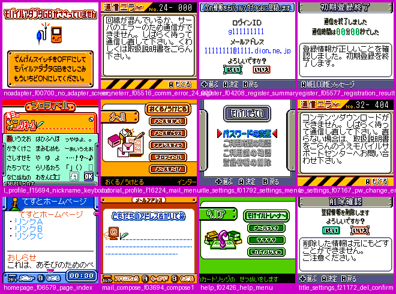

# Dynamic tracing of `baserom.gbc` (mGBA harness)

Evidence vocabulary: **CONFIRMED** = demonstrated by evidence cited here (exact bytes/addresses, disassembly, a trace),
**PROBABLE** = strong evidence, not conclusive, **HYPOTHESIS** = interpretation not confirmed. Addresses are `bank:addr`
with CPU addresses (bank 00 = 0000-3FFF, banks 01-7F = 4000-7FFF; file offset = bank*0x4000 + (addr & 0x3FFF)).
Names in this document are *descriptions*, never symbol names: unknown code stays `Function_<bank>_<addr>`.

Sections 0-8 describe the first round (18 scenarios); **section 9 onwards documents the second round (41 scenarios, 72 224 executed ROM instruction starts, hidden inputs, new harness features)**.

Everything below was produced by `tools/trace/run_trace.py` from `baserom.gbc`
(SHA-256 `6d802e66b54f700aa8c767dd4a3b9df200bae05e07a296fffb16ebf4efc76570`); numbers come from `traces/summary.md`,
`traces/*` and `analysis/coverage_union.tsv`.

**Golden rule: coverage is evidence that code exists and runs; absence of coverage proves nothing.**

## 0. Independent verification (adversarial review)

The claims below were re-derived from the raw ROM bytes and by re-running the tooling from a clean copy of the repository (empty `.cache/trace`, libmgba rebuilt out of tree, `run_trace.py --jobs 4`, 96 s).

* **Reproducibility (CONFIRMED).** After the clean re-run every `traces/coverage_*.tsv`, `mbc_writes_*.tsv`, `serial_*.tsv`, every file under `traces/detail/`, `traces/summary.md`, `traces/coverage_validation.txt`,
  `analysis/coverage_union.tsv` and `analysis/ram_code_dump.bin` was byte-identical to the committed copy (43 265 ROM + 14 RAM instruction starts). `run_trace.py --from-macro --only register_neterr,noadapter` regenerated
  `traces/inputs/*.txt` and outputs identically, and `--verify-determinism hotplug` (macro run vs replay of its recording, 22 output files) reported identical.
* **Decoder chain (CONFIRMED).** All 43 265 ROM rows of the union re-decoded with `tools/sm83.py` from `bank*0x4000+(addr&0x3FFF)`: instruction length and text equal the union columns, no executed address lies inside another instruction, no bank-0 address >= 4000, no bank != 00 address < 4000. Ten random covered addresses (seed 7) were checked the same way: all are consistent instruction starts and, except for one `ret`, their successor address is covered.
* **Bank mapping (CONFIRMED for the logged evidence).** Every executed bank number was written to `$2000/$2100` by a logged write; the first 600 MBC writes of every scenario (`detail/*/mbc_seq.tsv`) replay consistently (`bank_before/after` follow the previous write). Tracer bank = `gb->memory.currentBank` (mGBA's own mapping).
* **Numbers re-derived** from the trace files: IRQ vector counts, 30 029 `[$2000]<-75` writes at `00:01CD` = serial IRQs, 457 811 at `00:021F` = timer IRQs, MBC site counts, `jp hl` 27 sites / 215 targets, 151 `ret_unmatched` edges over 116 `ret` sites + 13 `ret_other`, rHDMA5 19 676 writes at 12 sites, 17 boot EEPROM reads, EEPROM image checksums `312C`/`31AC` (recomputed from the logged bytes), libmobile command list, network log lines, the `24-000` / `32-404` screens (screenshots viewed).
* **Stale library claim (CONFIRMED by timestamps and git).** `build-noble/libmgba.so.0.11.0` is dated 2026-09-08 11:20; the `setup` hook of `struct MobileAdapterGB` was added by commit `dc77896c1` on 2026-09-09, so the pre-built library and the current headers disagree. The gdb observation ("`setup` never called") was not repeated.

**Corrections made by the verifier (each is also marked at its place below):**

1. *Retracted:* "presence probe / `cp $FF`" (section 3, item 1) - HYPOTHESIS at best; in `noadapter` the ROM keeps sending full start-session packets after the `FF` answer.
2. *Corrected:* the interrupt thunks are re-targeted at run time (F1); the default installer `00:04A0` and the raster-effect installer `48:440A` are now located, and `00:059F` is the OAM-DMA copier (F2). This closes the first open question.
3. *Corrected:* "MBC registers are written only at these sites" holds for executed code only (F3); unexecuted sites exist.
4. *Corrected:* the LCD is switched off, not on, at `00:05E0/05FB`; the HDMA site list was incomplete (F6).
5. *Refined:* DNS failure -> `24-000` (stub-socket refusal, libmobile error `6E 02`), PPP id as logged (`g111111111`), "large parts of SRAM banks 1 and 2" -> parts (F8), "coroutine" idea for `00:018D` withdrawn (F4).
6. *Added:* SRAM/adapter-config boot matrix (F8), including the `9A-100` error for registered SRAM with a blank adapter.

Not re-checked by the verifier: the gdb-based stale-library observation, screen-name readings for scenarios other than the error screens and the boot matrix, the wall-clock speed figures (10-15 M instr/s), and the `real` network mode (never used for committed traces).

---------------------------------------------------------------------------------------------------------------

## 1. Quick start

```sh
tools/trace/run_trace.py                    # (re)build the tracer if needed, replay all scenarios (~2 min), refresh traces/, analysis/
tools/trace/run_trace.py --only homepage    # one scenario (+ the scenarios whose saved state it starts from)
tools/trace/run_trace.py --from-macro       # re-run the readable .macro scripts and regenerate traces/inputs/*.txt
tools/trace/run_trace.py --verify-determinism register_neterr   # run twice (macro, then replay of the recording), diff every output
tools/trace/run_trace.py --list
tools/trace/merge_coverage.py               # only the union + validation step
tools/trace/growth.py                       # traces/growth.md (coverage growth per scenario)
tools/trace/frontier.py --top 40            # ranked unexecuted-code gates
tools/apply_coverage.py                     # analysis/coverage_report.md (union vs config/regions; --apply on a copy of config)
python3 tools/trace/contact_sheet.py out.png .cache/trace/shots/<scenario>/*.png   # look at the screenshots of a run
```

Needs: `cmake make gcc python3` (Pillow only for `contact_sheet.py`), the mGBA fork source tree
(`MGBA_SRC`, default `/media/rafael/Dados/Arquivos/Projetos/Gameboy Projects/MobileAdapterGB/mgba/mgba`), and
`baserom.gbc` (hash-checked). Nothing needs a display or an X server (no SDL, no audio, no window is ever created).
Build products live in `.cache/trace/` (git-ignored; `make clean` does not touch it); screenshots go to
`.cache/trace/shots/<scenario>/` (not committed).

Outputs (all small text, committed):

| file | content |
|---|---|
| `traces/coverage_<s>.tsv` | executed instruction starts: `bank addr count first_frame` (+ RAM extras) |
| `traces/mbc_writes_<s>.tsv` | every distinct MBC-register write site/value |
| `traces/serial_<s>.tsv` | raw SB/SC activity (first 3000 events; the rest is in `detail/<s>/serialsum.tsv`) |
| `traces/summary.md` | digest of all scenarios, union totals, adapter commands |
| `traces/coverage_validation.txt` | decoder-consistency report of the union (section 6) |
| `traces/detail/<s>/` | `callgraph.tsv irq.tsv irqsum.tsv hwregs.tsv ramcode.tsv dataaccess.tsv serialsum.tsv mbc_seq.tsv marks.tsv adapter.log stats.txt` |
| `traces/inputs/<s>.macro/.txt` | scenario source (readable) and its resolved frame script (what is replayed) |
| `traces/scenarios.tsv`, `traces/web/` | scenario table, synthetic web pages of the fake Internet |
| `analysis/coverage_union.tsv` | union over all scenarios with decode of each executed instruction |
| `analysis/ram_code_dump.bin` | WRAM/HRAM image at the end of the `register` scenario (layout in 4.5) |

---------------------------------------------------------------------------------------------------------------

## 2. Emulator investigation and the route chosen

The fork is `MobileAdapterGB/mgba/mgba` (git `f8ec8e546`), an mGBA 0.11 with Mobile Adapter GB support (libmobile).

| route | what the fork offers | verdict |
|---|---|---|
| SDL frontend `build-noble/sdl/mgba` | usage text lists `--debug` (CLI debugger) and `--gdb` (GDB stub, port 2345) but **no `--script`**; it needs `LD_LIBRARY_PATH` for its sibling `libmgba.so`; it creates an SDL window and audio device (not tried with `SDL_VIDEODRIVER=dummy`). **It does not attach the Mobile Adapter**: only the Qt frontend, the GUI frontends and libretro call `GBSIOMobileAdapterCreate` (source grep). | not usable for scripted evidence |
| Qt frontend | Mobile adapter dialog, scripting console; needs a display | not headless |
| GDB stub / CLI debugger | breakpoints, watchpoints, single step; driving every instruction over a socket/pty is slow and hard to make deterministic | rejected |
| Lua scripting (`USE_LUA` is on in the pre-built lib) | reachable from the CLI debugger / Qt; the API is callback-based (frame, memory, breakpoints); instruction-level coverage would need one breakpoint per address. Not exercised (PROBABLE limitation, not tested) | rejected |
| **C harness linked against libmgba** | `mCoreFind/mCoreLoadFile/core->step`, direct access to `struct SM83Core` / `struct GB` (headers are in the tree) | **chosen** |

Why the C harness is the robust route: `core->step()` executes exactly one SM83 instruction (`_GBCoreStep` loops
`SM83Tick` until the CPU is back in `SM83_CORE_FETCH`), so the harness sees every instruction start, the real mapped ROM
bank (`gb->memory.currentBank`), and can interpose on `cpu->memory.load8/store8` (all CPU data accesses) and
`cpu->irqh.irqVector` (interrupt dispatch). It runs at roughly 10-15 M traced instructions/s (a 24 000-frame scenario
takes ~13 s), needs no display and is deterministic. Hardware behaviour therefore comes from mGBA, not from a home-made emulator (the fallback in the task was
not needed).

**Pitfall found (CONFIRMED)**: the pre-built `build-noble/libmgba.so.0.11.0` is dated 2026-09-08 while the headers/sources
of the fork are newer (2026-09-12; `struct MobileAdapterGB` gained fields, e.g. the `setup` hook). A harness compiled against
the *current* headers and linked against the *old* library reads/writes the wrong offsets silently (the `setup` hook was never
called). Likewise struct layouts depend on the feature macros used to build the library. `run_trace.py` therefore builds
libmgba out of tree from the source tree (`.cache/trace/mgba`, 20 s, no LTO, no Qt/SDL/Lua/ffmpeg) and takes the compile
definitions for the harness from that build's `CMakeFiles/mgba.dir/flags.make`. Do not link the harness against
`build-noble/`.

Emulation setup (deterministic): no config file is read, model `CGB` (header byte 0xC0), no BIOS (mGBA HLE boot), idle
optimisation off, SRAM lives in memory (never touches a `.sav` on disk) and starts 0xFF-filled (a blank cartridge; the
real power-on content is unknown), wall clock is never consulted (libmobile time goes through the emulated cycle counter).

---------------------------------------------------------------------------------------------------------------

## 3. The Mobile Adapter in the emulator (and how the ROM uses it)

* The fork emulates the adapter with libmobile as a serial-port peer (`GBSIOMobileAdapter`). The harness attaches it with
  `GBSIOMobileAdapterCreate()` + `GBSIOSetDriver()`; `--mobile on|off`, `--mobile-at FRAME` (hot-plug) select it. With
  `off` there is no peer at all (serial reads return 0xFF, as a real link port with nothing plugged in).
* The adapter config (libmobile's 0x200-byte EEPROM image) starts blank unless `--mobile-config-in FILE` is given;
  `--mobile-config-out FILE` saves it. Scenarios chain their final SRAM + config through `.cache/trace/state/`.
* Network sockets are replaced by the harness (`--net`): `stub` = every socket open is refused (the ROM sees "no Internet"),
  `fake` = a small deterministic Internet inside the harness (DNS: every name resolves to `10.0.x.y`; POP3 `+OK`; SMTP 250/354;
  HTTP: pages from `traces/web/` else 404), `real` = host network (never used for committed traces: not reproducible).
  Everything the ROM sends is logged in `detail/<s>/adapter.log` (`gb.mobile` = libmobile command trace, `NET` = fake network).

What the ROM does with it, seen through libmobile's command log and the serial trace (all CONFIRMED unless stated):

1. **First serial byte (`4B`) and the "adapter not plugged in" screen.** At power-on (frame 44) the ROM writes SB=`4B`, then SC=`03`, SC=`83`
   (75:5B32, 75:5B3F, 75:5B43) and reads the received byte at 75:56F6. With no adapter that byte is `FF`, with the adapter `00`
   (`traces/serial_noadapter.tsv` vs `traces/serial_register.tsv`, first rows; CONFIRMED observation). With the adapter the ROM goes on into a libmobile
   session; without it the "adapter not plugged in" screen appears (CONFIRMED observation, screenshots of `noadapter`).
   **Retracted / downgraded (verifier):** the first version of this document called the `4B` byte a "presence probe" whose answer (`FF` vs `00`) decides the error
   screen, guessing `cp $FF`. That is a HYPOTHESIS, and the evidence points elsewhere: in `noadapter` the ROM does **not** stop after the `FF` answer. Every attempt
   (six of them, frames 44, 761, 969, 1177, 1285, 1393 in `traces/serial_noadapter.tsv`) sends `4B` and, ~7 frames later, the complete
   start-session packet `99 66 10 00 00 08 4E49 4E54 454E 444F 02 77 80 00` with all answers `FF`, so the error is raised after the
   packet exchange failed (retry count), not by a one-byte test. `4B` is libmobile's idle byte that the game sends after a packet (`serial.c`, `MOBILE_SERIAL_IDLE_CHECK`),
   so calling it a probe is an interpretation. The received-byte handler is the state machine at 75:56D2..5760 (state byte `C6A0`, received bytes stored at `C6A8+`,
   compared with the expected value in `C6BE`, `FF` = "do not compare", `F2/F1/F0` special-cased); the exact condition that ends in the error screen is **not identified**.
   The error screen only retries when a button is pressed (scenario `hotplug`: A before the plug-in at frame 1200 still fails, A after it succeeds; PROBABLE, read from the screens).
2. **Session framing.** The serial rows show the libmobile packet layer: `99 66` magic, command byte, `00 00 08` length, payload
   `4E 49 4E 54 45 4E 44 4F` ("NINTENDO"), every byte sent with the same SC=`03`/`83` pair and answered with `D2` while the adapter
   is in packet mode (`traces/serial_register.tsv`, frames 51-53 / 176-177).
3. **Commands issued (libmobile names, `traces/summary.md`)**: `10 Start session`, `11 End session`, `19 Read EEPROM`,
   `1A Write EEPROM`, `17 Status` (polling), `12 Call`, `13 Disconnect`, `21 PPP connect`, `22 PPP disconnect`, `28 DNS request`,
   `23 TCP connect`, `24 TCP disconnect`, `15 Transfer data`. Nothing else was issued in any scenario (e.g. no listen/accept-type
   commands, no config-write commands other than the EEPROM writes).
4. **Adapter EEPROM use.** Boot reads EEPROM `0x00..0x7F` then `0x80..0xBF` (17 times over all scenarios); later code reads
   `0x00..0x5F` then `0x60..0xBF`. Registration writes `0x00..0x7F` and `0x80..0xBF` **twice**: first with byte 2 = `01`,
   after the connection check succeeded with byte 2 = `81` (`detail/register/adapter.log`, lines "Write EEPROM"). The 0xC0-byte
   image begins `4D 41` ("MA"), byte 2 = state (`01` incomplete, `81` complete), DNS1 `D2 C4 03 B7` (210.196.3.183), DNS2
   `D2 8D 70 A3` (210.141.112.163), then login ID, mail address, POP/SMTP host names typed/derived by the ROM, and the last two
   bytes `0xBE-0xBF` = **big-endian 16-bit sum of bytes 0x00..0xBD**: `312C` for the `01` image and `31AC` for the `81` image
   (reproduced exactly from the logged bytes of both images). This explains the screens "初期登録再開"
   (resume, state `01` in EEPROM + SRAM) versus a completed registration.
5. **Network endpoints requested by the ROM** (from the fake Internet log): dial `#9677` (DION account: PPP as the typed login
   ID, DNS 210.196.3.183 / 210.141.112.163, POP3 `pop.<subdomain>.dion.ne.jp:110` USER/PASS/STAT/QUIT), dial `#9477` (PPP as `guest`,
   DNS 192.168.40.2) then HTTP to `mgb.dion.ne.jp` (`POST /cgi-bin/mgb/daa_gb_pwdchg.cgi`, `POST /cgi-bin/mgb/daa_gb_jikan.cgi`,
   `GET /cgb/utility?request=summary`, User-Agent `CGB-B9AJ-00`) and HTTP to `gameboy.datacenter.ne.jp`
   (`GET /01/CGB-B9AJ/index.html` and relative links below `/01/CGB-B9AJ/`, image requests `images/*.bmp`). A 404 from the server
   produces the on-screen error `32-404`; in `register_neterr` (net `stub`, every socket refused by the harness) the DNS request (cmd `28`) is answered by libmobile with error `6E 02`
   and the ROM shows `24-000` (screens read by the verifier; the ROM does not distinguish DNS from POP failure in these runs, so "DNS failure" was too specific).
   PPP is dialled with the id as logged by libmobile, `g111111111` for the typed digits (cmd `21`), while POP3 `USER` is the 8-digit `11111111`; the origin of the leading `g` was not analysed. The response formats of the CGI calls are not known, so the
   fake server only answers 404 for them (those paths' success branches are not exercised).

---------------------------------------------------------------------------------------------------------------

## 4. How the tracer works

`tools/trace/mgba_trace.c` (compiled by `run_trace.py`), one process per scenario.

### 4.1 Instruction stream and coverage
Before every `core->step()` the harness records `pc = cpu->pc`, the mapped ROMX bank (`gb->memory.currentBank`, bank 0 for
`pc < 0x4000`) and the opcode. If the step turned out to be an **interrupt dispatch** (detected inside the wrapped
`irqVector` hook, also after a HALT wake-up) it is *not* counted as an instruction. Otherwise `(bank or region, pc)` is counted.
Regions: ROM bank number (2 hex digits), `WRAM` (C000-FDFF, echo folded), `HRAM` (FF80-FFFE), `VRAM`, `SRAM`, `OTHER`.
For RAM addresses the 3 bytes at the address are recorded at first execution and every later change is counted
(`changed`); for D000-DFFF the SVBK bank is recorded. `detail/<s>/ramcode.tsv` lists every distinct 3-byte window seen at an
executed RAM address (at most 12 per address + a remainder row), which makes self-modifying/relocated code visible.

`coverage_<s>.tsv` columns: `bank addr count first_frame` and, for RAM rows only, `first_bytes changed wram_bank`
(comment lines start with `#`). `first_frame` = frames completed before the first execution (0 = before the first VBlank).

### 4.2 MBC writes, serial, hardware registers, interrupts
`cpu->memory.store8/load8` are wrapped, so every CPU data write/read is seen with `pc`, the bank at `pc` and the frame.
* `mbc_writes_<s>.tsv`: one row per distinct `(pc_bank, pc, register address, value)` with counts, first/last frame and the mapped
  ROMX bank before/after; `detail/<s>/mbc_seq.tsv` is the raw sequence of the first 600 writes (shows the call sequence).
* `serial_<s>.tsv`: `frame pc_bank pc reg kind value repeat`; kinds `W` write, `R` read (consecutive identical reads from the
  same pc are folded into `repeat`), `X` = a transfer completed in that step (value = SB afterwards). First 3000 events;
  `detail/<s>/serialsum.tsv` counts every `(pc, reg, kind)` without a cap.
* `detail/<s>/hwregs.tsv`: writes to rLCDC rSTAT rLYC rDMA rDIV rTIMA rTMA rTAC rKEY1 rVBK rHDMA1-5 rRP rBCPS rBCPD rOCPS rOCPD
  rSVBK rIE, aggregated by (register, pc, value) (`*` for the palette data ports, whose values would explode the file).
* `detail/<s>/irq.tsv` (first 200 raw entries with the interrupted pc, IF, IE) and `irqsum.tsv` (count per vector).
* `detail/<s>/dataaccess.tsv`: merged address ranges of ROM bytes read as data (not instruction fetch) and of SRAM bytes read/written,
  per SRAM bank - direct evidence of tables/strings/graphics/save-data layout.

### 4.3 Call graph
`detail/<s>/callgraph.tsv`: `kind from_bank from_pc to_bank to_addr count first_frame`. `call`/`rst` edges are recorded only when
the call really happened (SP moved down by 2). `irq` = interrupt entry (from = the vector). `jphl` = target of every `jp hl`
(jump tables / dispatchers). A **shadow return stack** classifies `ret`/`reti`: `ret` (returned to the address its call pushed;
recorded per ret instruction only), `ret_other` (returned elsewhere; the expected address is shown) and `ret_unmatched` (no matching
call: push/ret jump tricks or stack switching). The bank column is the ROM bank mapped when the edge was taken.

### 4.4 Input scripting (`traces/inputs/`)
Two equivalent forms; the harness replays the second, the first is how it is authored.
* `<name>.macro` (run-time macro, `mgba_trace --macro`): `wait N`, `gap N`, `taplen N`, `tap BTN [xN]`, `hold BTN N`,
  `shot [name]`, `mark text`, `waitstable N [max M]` (run until the LCD image was unchanged for N frames or M frames elapsed),
  `waitchange [max M]`, `monkey N SEED [GAP]` (seeded pseudo-random taps, PRNG inside the harness), `end`. Buttons: `A B SELECT START
  UP DOWN LEFT RIGHT`, joined with `+`. `waitstable` on a screen with a blinking cursor never becomes stable and simply runs to its cap
  (so a script's timing includes those caps; harmless, deterministic).
* `<name>.txt` (frame script, `--input`), written by `--record-input`: `<frame> <BUTTONS|->` (hold exactly those buttons from that
  frame on), `<frame> tap <BTN> [len]`, `<frame> shot [name]` (screenshot at the start of that frame), `<frame> mark <text>`.
  The file header `# last scripted frame: N` is where a replay stops. `--verify-determinism` proves that replaying the recording
  reproduces the macro run byte for byte (all output files and all screenshots).

### 4.5 `analysis/ram_code_dump.bin`
Written at the end of the `register` scenario. Layout (32 896 bytes): `0x0000-0x0FFF` WRAM bank 0 (C000-CFFF);
`0x1000-0x7FFF` WRAM banks 1..7 (D000-DFFF each, bank *n* at `0x1000*n`); `0x8000-0x807F` HRAM FF80-FFFF (the last byte is IE).
It is the full RAM, not only code: executed RAM addresses are in `coverage_*.tsv`/`coverage_union.tsv`
(rows with bank `WRAM`/`HRAM`) and their observed bytes in `detail/*/ramcode.tsv`.

### 4.6 Adding a scenario
1. Write `traces/inputs/<name>.macro` (start from a similar one; use `shot` liberally and look at `.cache/trace/shots/<name>/` through
   `contact_sheet.py`; label screens by what you *see*, not by guessed code names).
2. Add one row to `traces/scenarios.tsv` (mobile on/off/at:N, net stub/fake, `from` = scenario whose saved SRAM+adapter config it
   starts from, web 0/1).
3. `tools/trace/run_trace.py --from-macro --only <name>` (this writes `traces/inputs/<name>.txt`), check screenshots, then
   `tools/trace/run_trace.py --verify-determinism <name>`, then the full `tools/trace/run_trace.py` to refresh the union/summary.
4. Every scenario should end in a state you can describe; if a screen cannot be identified, say so in the macro comments.

---------------------------------------------------------------------------------------------------------------

## 5. Scenarios

Full table: `traces/scenarios.tsv`. Screens reached (montage: `docs/research/img/scenario_screens.png`; all screen names are my reading of the
Japanese screens, not derived from code):



| scenario | reaches |
|---|---|
| `noadapter` | "モバイルアダプタGBがささっていません" error screen; button retry loop |
| `hotplug` | same; a button press before the plug-in re-runs the check ("モバイルアダプタGBをチェックしています") and fails again; after the harness plugs the adapter in, a button press ends in the registration notices ("初期登録のご注意" 1/3) |
| `register_neterr` | blank cartridge: 初期登録 intro/notices, login-ID keypad (10 digits), mail address (8 + 4 chars), password (twice), save confirmation, summary, dial DION, communication error **24-000**, "初期登録を中止しました" (turn power off) |
| `resume_registration` | "初期登録再開", then the same summary/connection with a working fake POP3, "初期登録終了", WELCOME messages, title screen |
| `register` | full registration incl. POP3 check, WELCOME messages, title screen |
| `tutorial_profile` | title, first-run tutorial (about 80 pages), nickname keyboard (kana), mail menu (おくる/うけとる, メールをかく, メールボックス, アドレスちょう, プロフィール, メールサーバ), send/receive over fake POP3, "通信けっかはっぴょう", mail-server status |
| `title_settings` | モバイルせってい: パスワード変更 (POST CGI -> 404 -> error 32-404), ご利用時間の確認 (POST CGI), ご利用額の確認 (GET), 登録情報の削除 (two confirmations, EEPROM cleared) |
| `mail_compose` `mail_mailbox` `mail_addressbook` `mail_profile` `mail_server` | the mail sections: writing and saving a mail (address, title, body); the empty mailbox; the address book list and its new-entry keyboard (nothing saved); the profile screen and nickname keyboard (nothing saved); server-mail management with a real POP3 session (STAT) against the fake server |
| `homepage` | ホームページ: tutorial, connect, page load from the fake HTTP server, HTML render, following links, browser menu (START/SELECT), back |
| `help` | ヘルプ entries |
| `monkey_1..3`, `monkey_blank` | seeded random button mashing (24 000-30 000 frames) from the set-up cartridge / from a blank one |

Not reached in the first round (the second round, section 9, did reach real SMTP/POP3 exchanges, mailbox/address-book use, bookmarks, error screens and three hidden inputs; the CGI success format is still unknown): anything that needs a *successful* answer to the `daa_gb_*.cgi`/`/cgb/utility` requests, real mail
delivery/reception (the fake POP3 always reports an empty mailbox; SMTP is only served, the ROM never got to send in these runs),
Pokemon Crystal-style data exchange with other cartridges, the `mobile_homepage` pages of the original site beyond the synthetic ones,
audio, and any path that depends on the real clock/RTC. Coverage numbers below therefore only bound what was executed.

---------------------------------------------------------------------------------------------------------------

## 6. Findings (initial)

Union of the 18 scenarios: **43 265 executed ROM instruction starts in 44 ROM banks** plus 14 RAM addresses
(`analysis/coverage_union.tsv`, `traces/summary.md`). ROM banks that executed code: `00 04 0E 1A 1C 1D 1F 22 23 25 26 27 28 29 2A 2B
2C 2D 2E 2F 48 4C 4E 4F 51 54 55 57 5C 63 65 67 68 69 6C 70 72 73 74 75 7C 7D 7E 7F`. Every one of them is a bank the census in the task marks
as containing data; none of the 0x00-padding banks ever executed (CONFIRMED for these runs).

**F1. Interrupt vectors go through WRAM thunks (CONFIRMED; contents are re-targeted at run time).** Vectors taken over all scenarios (`detail/*/irqsum.tsv`): 0040 222 106x,
0048 3 234 384x, 0050 457 811x, 0058 30 029x; **0060 (joypad) never** (its thunk `CBFD` is a `reti`, see below). The vectors jump (`jp $CBF1/CBF4/CBF7/CBFA`, bytes at 00:0040..) into WRAM
thunks. **Verifier correction:** the thunk bytes are *not* fixed. `detail/*/ramcode.tsv` (union over scenarios) shows `CBF1` = `jp $03BA` (199 870 runs) **or** `jp $16D4` (22 236 runs), `CBF4` = `jp $0E93` (44 897)
**or** `jp $16C4` (3 189 487), `CBF7` = `jp $01ED` and `CBFA` = `jp $01B7` (fixed). In the `register` end-of-run dump (`analysis/ram_code_dump.bin`, offset 0xBF1) `CBF4` is `D9` (`reti`).
* Installer of the default thunks (CONFIRMED, located by the verifier): **`00:04A0..04D7`** (executed at frame 16 in every scenario) stores `C3 BA 03` at `CBF1`, `D9` at `CBF4` and `CBFD`, `C3 ED 01` at `CBF7`, `C3 B7 01` at `CBFA`,
  i.e. VBlank -> `00:03BA`, STAT -> `reti`, timer -> `00:01ED`, serial -> `00:01B7`, joypad -> `reti`.
* Re-targeting (CONFIRMED by disassembly + coverage): the routine at **`48:440A..445F`** (first executed frame 1140 in 11 scenarios) sets `rSTAT=08`, `rLYC=80`, copies the current thunks `CBF4..CBF6` to `C130..C132` and `CBF1..CBF3` to
  `C133..C135`, installs `jp $16C4` at `CBF4` (STAT handler `00:16C4`: at LY=$80 loads `SCX` from `[C0EF]`) and `jp $16D4` at `CBF1` (VBlank wrapper `00:16D4`: `SCX=0`, then `jp $C133`, the saved original VBlank thunk = the `WRAM C133 jp $03BA` row of the union), enables IE |= 03 and `ei`. This is what the 22 236 executions of `WRAM:C133` are.
  `jp $0E93` at `CBF4` is a different STAT handler (00:0E93, disassembly: if LY=0 it sets `LYC` from `[D724]` (WRAM bank 1) and `SCY=0`, otherwise `SCY=[C0D3]`, `LYC=0` and, if `[D824]!=0`, `call $0392`; a scanline-split effect, PROBABLE); which routine installs it was not searched.
* Their handlers are in bank 00. **The earlier open question "which routine copies the thunks" is answered** by `00:04A0` (default thunks) and `48:440A` (raster-effect thunks); the caller chain was not analysed.

**F2. OAM DMA routine in HRAM (CONFIRMED).** HRAM FF80-FF89 executes `ld a,$C0 / ldh [$FF46],a / ld a,$28 / dec a / jr nz,$FF86 / ret`
(coverage rows `HRAM FF80..FF89`; the `rDMA` write at `HRAM:FF82` with value C0 happens once per VBlank: 222 105 times). Source page C000 = shadow OAM.
It is invoked from the VBlank handler `00:03BA` only when `[C2F5] == 0` (`00:03BB ld a,[$C2F5] / or a / jr nz / 00:03C1 call $FF80`; disassembly).
**Where the HRAM code comes from (CONFIRMED, located by the verifier):** `00:059F..05AB` copies 10 bytes from `00:05AC..05B5` (`3E C0 E0 46 3E 28 3D 20 FD C9`, byte-identical to `FF80..FF89` in `analysis/ram_code_dump.bin`)
to `FF80` (`ld hl,$05AC / ld bc,$0A80 / ld a,[hli] / ldh [c],a / inc c / dec b / jr nz`); executed first at frame 8 (72 times over 18 scenarios).

**F3. Bank switching (CONFIRMED by disassembly + `mbc_writes`).** MBC5 registers are written at these sites **in the traced runs** ("only" holds for executed code; a static byte scan for `ld [$2000-$3FFF],a` (`EA lo hi`) finds further, never-executed sites, e.g. `00:025B/025F/026D/0271/02A6`, `00:0D3B/0D49/0DD0/0DDE/0E34/0E7A/0E80/0E8F/169C` and `29:510F/5113` = `ld [$2000],a / xor a / ld [$3000],a / ret`; the "high bit always 0" statements below are likewise observations):
* `[$2000]`/`[$3000]` (ROM bank low/high): `00:2101` (`ld [$2000],a / ret`) and `00:2107` (`ld [$3000],a / ret`, high bit always 0), plus the open-coded
  pairs in the interrupt handlers `00:01CD/01D2`, `00:021F/0224` (switch to bank **75**) and restore sequences `00:01E1/01E5`, `00:0233/0237`, `00:0182/0187`.
* `[$2100]` (also ROM-bank low byte, through the register's mirror): `00:0639` (0.95 M writes), `00:066F`, `00:0A8F`, `00:0654`, `00:0DBB`... inside the
  bank helper below. Values written are always <= 0x7F; the high-bit register `3000` only ever gets 00.
* `00:0622` is a helper "select bank A for the address class of HL" (`or a / ret z`, then by `H`: `< $80` -> `ldh [$FF8A],a; ld [$2100],a`
  (ROMX), `$80-$BF` -> `ldh [$FF8C],a; ld [$4000],a` (SRAM bank), `>= $C0` -> `ldh [$FF8D],a; ldh [$FF70],a` (WRAM bank)); `00:0673` reads the current bank
  of an address class back from `FF8A/FF8C/FF8D` (00:0673..0683). HRAM `FF8A/FF8B` therefore hold the current ROMX bank (low/high byte), `FF8C` the SRAM bank,
  `FF8D` the WRAM bank (PROBABLE: consistent reads/writes in 00:0622/0673/01B7..). Verifier's static scan of the ROM: direct `ldh [$FF8A]`/`ldh [$FF8B]` stores (`E0 8A`/`E0 8B`) occur only in bank 00 (37 and 5 byte hits; data false positives possible), whereas `ldh [$FF8C]` and `ldh [$FF8D]` stores appear in many banks, so `FF8C/FF8D` are also set outside the 00:0622 helper (each next to its `[$4000]`/`[$FF70]` write, not checked one by one). Class boundaries in the helper are by the high address byte (`H<$80`, `$80-$BF`, `>=$C0`), so class `$80-$BF` also contains VRAM addresses, not just SRAM.
* `[$0000]` (SRAM enable) is written from 209 sites, [$4000] (SRAM bank) from 160 sites (executed sites only; counts of distinct `pc` in `mbc_writes_*.tsv`, re-derived by the verifier: 2000:7, 3000:8, 2100:23, 0000:209, 4000:160).

**F4. Far-call convention with inline operands (PROBABLE, strong).** `00:06D1` is the callee of 2189 call sites whose fall-through address is never executed
(`traces/coverage_validation.txt`, "grouped by callee"). Disassembly of 00:06D1..0713: it stores A/HL into HRAM `FFA9/FFAB/FFAC`, does `pop hl` (the return
address = pointer to *inline argument bytes placed after the call*), loads three inline bytes into `FFAE/FFAF/FFF2` (target address low/high and a bank byte),
`push hl` (return address moved past the inline bytes), `call $0673`/`call $0622` to save/select banks, and finally `call $FFA8` / `jp $FFA8`.
The call graph (`detail/*/callgraph.tsv`, union) has 27 `jp hl` sites with 215 observed targets, e.g. `00:0550` (table dispatch: `add hl,de` twice, load word, `jp hl`) with
targets in banks 1C, 4F, 65, 68, 6C, and per-bank dispatchers `04:45DA`, `0E:4093`, `55:5FC7`; and 151 `ret_unmatched` edges (116 `ret` sites) plus 13 `ret_other` edges,
i.e. returns whose SP/address do not match a call frame the tracer saw. Not analysed further: candidates are the inline-argument far call itself and stack-switching code such as
`00:018D..01B6` (saves A/HL into `C823..C825` and returns through them) - HYPOTHESIS: a coroutine/context-switch style mechanism.

*Verifier addendum to F4 (disassembly re-derived from the ROM bytes; mechanism text is PROBABLE, no names claimed).* The whole return path of `00:06D1` is visible in `00:06EE..0713`: after the far call returns (`call $FFA8` at `00:06FC`) it re-saves A/HL, restores the saved
bank (`pop hl` / `call $0622`), pops the real return address into `FFAE/FFAF` and leaves through `jp $FFA8`, so control resumes **after the 3 inline bytes** (call site + 6), never at the call site + 3 the validator looks at. That explains `FALL_MISSING` for all 2189 sites.
The other callees of the group are of the same kind: `00:0545` is an inline jump table (`pop hl`, index `A*2`, `jp [hl]`, table words follow the `call`) and `00:056A` computes an index from the joypad state and jumps to `00:0545`.
Of the `ret_unmatched`/`ret_other` edges (union over scenarios, counting per-scenario duplicates) most return to `00:06FF` (141, the return point of `call $FFA8` inside that helper), `75:5E31` (111) and `00:018D` (66); so the far-call helper and a
bank-75 trampoline (`00:0155..018A` saves A/HL to `C823..C825`, pushes the current bank word, selects bank 75 and does `jp $4030`; `00:018D..01B6` pops the bank word, restores the bank and A/HL and returns) explain a large part, and a tracer shadow-stack artefact across `jp $FFA8` cannot be excluded. The "coroutine" idea above is not supported by this reading (downgraded: withdrawn as HYPOTHESIS).

**F5. Self-modified HRAM thunk at FFA8-FFAF (CONFIRMED).** `00:0684..06B6` initialises HRAM `FFA8=3E`, `FFAA=21`, `FFAD=C3`, `FFAE/FFAF=B7 06`; afterwards the
bytes at `FFA9`, `FFAB/FFAC`, `FFAE/FFAF` change constantly (`ramcode.tsv`: e.g. `FFA8: 3E 00 21`, `3E 01 21`, `3E 7F 21`, ... and `FFAD: C3 xx xx` with dozens of targets).
Meaning (PROBABLE): `ld a,<bank>` / `ld hl,<arg>` / `jp <target>` assembled at run time by the routine in F4. Default target `00:06B7` is `call $044B; jr $06B7`, an endless loop.

**F6. Double-speed mode at boot (CONFIRMED).** `00:060E: ldh [rKEY1],1` (hwregs), followed by `stop` at `00:0619` (executed once per run, frame 0). The caller is `00:0290..0292` (`ld a,$80 / call z,$0602` when the boot value of A is `$11`, i.e. a CGB), and `00:0602` switches only if `KEY1` bit 7 differs from the requested bit 7, so the run really enters double speed.
The LCD is switched **on** at `00:05BA` (`rLCDC` = 83/87/C3/E3.. in `hwregs.tsv`) and **off** (bit 7 cleared, values 03/43/63/11) at `00:05E0` and `00:05FB` after waiting for LY in 91..97 (the first version listed all three as "on": retracted); over all scenarios CGB palettes are streamed through rBCPD/rOCPD from `00:034D` and `4F:4070..` (0.82 M data writes to *each* of rBCPD and rOCPD: the same 9 `ldh [c],a` sites write both, selected by `C`),
VRAM DMA (`rHDMA1-5`) is programmed from 12 sites (rHDMA5 trigger writes at `00:0774`, `00:07B2`, `25:53A7`, `26:59D4`, `29:505C`, `2A:5C58`, `2B:4740`, `2C:443E`, `2C:66BA`, `2D:5088`, `2D:6CA9`, `7F:72DF`; 19.7 k HDMA5 writes), `rVBK` from 38 sites, `rSVBK` from 989 sites (WRAM banks 1-7 used).

**F7. Serial / timer machinery (CONFIRMED).** Serial interrupt: `WRAM:CBFA -> 00:01B7`, which saves the current ROMX bank, switches to **bank 75**, calls `75:56D2`, and restores
the bank (`00:01C5..01E5`); it runs once per received byte (30 029 over all scenarios = number of `[$2000]<-75` writes at 00:01CD). Timer interrupt: `CBF7 -> 00:01ED`, stops the timer
(`rTAC`), acknowledges IF, later switches to bank 75 and calls `75:58EA` (00:021F..0227). Bytes are sent by `75:5B32` (SB) + `75:5B3F/5B43` (SC = 03 then 83),
and received in `75:56F6/5811/5884/589E/58CE` (`serialsum.tsv`); `00:0207` polls SC. `rTAC=06 / rTIMA=B0 / rTMA=B0` at `00:0240`, `00:023C`, `75:40FA..4113`.
So bank 75 holds the ROM's Mobile Adapter link layer (PROBABLE: serial primitives + libmobile-shaped packet traffic in `serial_register.tsv`).

**F8. Save RAM use (CONFIRMED for what is stated).** On a factory-fresh (0xFF) SRAM the first run writes all of `A000-BFFF` of SRAM bank 0 and parts of banks 1 (about 3.3 KiB of 8 KiB) and 2 (about 0.4 KiB)
(`detail/register/dataaccess.tsv`, `sram_write` rows; banks 3+ untouched in that scenario). Registration/tutorial/profile progress persists in SRAM across power cycles (`resume_registration`,
`tutorial_profile` start from a saved SRAM). During exploration (not a committed scenario) booting with the registered adapter config but a *factory-fresh* SRAM started a new
registration, so the boot decision depends on SRAM as well as on the adapter EEPROM; the converse (SRAM without adapter config) was not tested.
**Verifier re-run of both boot combinations (CONFIRMED, screenshots at frame 1450, harness flags `--mobile on --net fake`, `--mobile-config-in .cache/trace/state/register.cfg`, `--save-in .cache/trace/state/register.sav`):**
fresh 0xFF SRAM (or 0x00 SRAM) + registered adapter config -> "初期登録開始" (start of initial registration); registered SRAM + registered config -> title screen (モバイルトレーナー / スタート / モバイルせってい);
**registered SRAM + blank adapter config -> error screen `No.9A-100` ("モバイルアダプタの登録情報エラーです。データを初期化します。" = mobile adapter registration data error, data will be initialised)**. These runs are not committed scenarios.

**F9. Coverage validation (CONFIRMED).** `tools/trace/merge_coverage.py` decodes every executed address with `tools/sm83.py` from the bank that was mapped and finds
**0 inconsistencies** (no illegal opcode executed, no address inside another executed instruction, no bank-window violation) and 570 conditional branches that were
always taken in the traced runs. 2227 `call` sites without executed fall-through are all explained by callees that consume inline data or rewrite the return address
(00:06D1: 2189, 00:0545: 20, 00:056A: 15, 4B51/5691/06BC: 1 each) - i.e. **data bytes directly after a call are inline arguments**, which a linear disassembler will
mis-decode as code (this matters for `gen_asm`).

### What this means for the disassembly work
* Regions executed as code are ground truth for `config/regions` (`code`), *unless* the executed bytes are inline data (F4). Treat bytes after `call $06D1` (and the other
  no-return callees listed in the validation report) as `data`.
* `dataaccess.tsv` rows are ground truth for `data`/table regions (bytes read by the ROM as data).
* The hard facts about bank handling (F3) and the two HRAM thunks (F2, F5) should become named constants/symbols only after review; today they are documented, not named.

---------------------------------------------------------------------------------------------------------------

## 7. Limitations and things that can mislead

* Coverage is evidence of code; **absence proves nothing** (only 41 scripted/monkey scenarios, see section 9; the fake Internet is minimal; CGI success paths, mail delivery, other-player
  features and timeouts are unexplored).
* mGBA's hardware model is authoritative but not perfect (e.g. timing of serial/timer interrupts relative to the CPU is emulated at the M-cycle level; libmobile's adapter
  is an *implementation* of the protocol built by the community, not the original firmware; its answers (e.g. the idle byte `D2`, empty EEPROM = "unregistered") define what
  the ROM sees).
* The **fake server** decides which screens exist in a run (e.g. DNS always succeeds; POP3 always accepts any password; all `.html` get the same synthetic page). Screens/paths
  seen there prove the ROM *can* do that, not that a real server would answer that way.
* Screen names come from reading Japanese text off screenshots; they label scenarios, they are not code names.
* `waitstable` timing depends on the emulator; scripts are replayed from `.txt`, so they stay reproducible even if a macro's waits change.
* SRAM is initialised to 0xFF (blank); a real cartridge's initial contents may differ, changing the first-boot path only.
* Screenshots and the built emulator are not committed; the fork source path is machine specific (`MGBA_SRC`).
* Instruction tracing counts *dispatched* instructions; the interrupt dispatch itself and DMA transfers are not instructions. Data reads by DMA (OAM/HDMA) are not
  seen by `dataaccess.tsv` (the wrapper only sees CPU accesses).
* A callee that never returns (e.g. the endless loop at `00:06B7`) or the last instruction of a run always shows up as `FALL_MISSING` in the validation.

## 8. Next steps enabled by this harness
* ~~Watch writes to `C000-CFFF`/`FF80-FFFF` to find the routine that installs the interrupt thunks and the OAM-DMA code~~ (done statically by the verifier: `00:04A0`, `00:059F`, `48:440A`, see F1/F2); a write-watch is still useful for the other self-modified RAM code (`FFA8` thunk, `CBF4 = jp $0E93` installer).
* Add scenarios that need a real HTTP/CGI answer once the request/response formats are known (Mobile_Trainer_Web_Pages.7z may help).
* Feed `dataaccess.tsv`, `callgraph.tsv` (`call`/`jphl` targets) and `coverage_union.tsv` into `config/regions` and `config/symbols` generation.

---------------------------------------------------------------------------------------------------------------

## 9. Second round: raising coverage (scenarios, harness features, findings)

Sections 0-8 describe the first 18 scenarios (43 265 executed ROM instruction starts, 44 banks). The second round adds **23 scenarios** (table
below) and reaches **72 224 executed ROM instruction starts in 47 banks** (`analysis/coverage_union.tsv`, `traces/growth.md` for every step). Measured
against the current `config/regions` (221 762 code bytes; the classifiers keep changing that number): executed instruction bytes 84 035 -> 139 091;
code bytes in regions whose every instruction start ran 89 535 -> 104 911. The first 18 scenarios were re-run with the extended tracer and are
**byte-identical** to the earlier commit (every `coverage_/mbc_writes_/serial_*.tsv`, `detail/*`, `inputs/*.txt`), and a second full run reproduced
the union exactly. **Golden rule unchanged: coverage proves code runs; absence proves nothing** (see 9.5 for why part of the
remainder is probably dead code, PROBABLE).

### 9.0 Independent verification of the second round (adversarial review)

Re-derived, not copied from the round's own prose:

* **Clean re-runs (CONFIRMED).** Two full runs of all 41 scenarios in scratch copies of the repository with an empty `.cache` (libmgba rebuilt): (a) replay of the recorded `traces/inputs/*.txt`, (b) `run_trace.py --from-macro` (macros re-interpreted, `.txt` regenerated). In both, every file under `traces/` (coverage_, mbc_writes_, serial_, `detail/*`, `inputs/*.txt`, `summary.md`, `coverage_validation.txt`), `analysis/coverage_union.tsv` and `analysis/ram_code_dump.bin` is byte-identical to the committed copy. `make_campaigns.py` and `make_fixtures.py` regenerate the committed macros, mails and BMPs byte for byte. The 18 first-round scenarios are identical to git `HEAD`.
* **Determinism (CONFIRMED).** `--verify-determinism` (macro run vs replay of the recording, chains included) was additionally run for `mail_send`, `mail_receive`, `mail_inbox`, `addressbook_full`, `browser_bookmarks`, `browser_pages`, `mail_server_full`, `monkey_camp_tut`, `monkey_camp_reg`, `monkey_camp_reg2` (2-9 chained scenarios and 52-330 output files each): all identical. The other 13 new scenarios were checked by the round itself with the same option (not repeated here), and all 23 are covered by the two clean re-runs above.
* **Union (CONFIRMED).** Recomputed from the 41 `coverage_*.tsv`: 72 238 rows (72 224 ROM + 14 RAM), identical counts and scenario counts; the first-round union (43 265 ROM rows) is a subset; the banks added are `0F`, `24`, `50` (44 -> 47). All 72 224 ROM rows re-decoded with `tools/sm83.py`: lengths equal, no executed address inside another instruction, none crossing a bank window. `traces/growth.md` (starts, new, cumulative, banks, executed instruction bytes for each of the 41 rows) was recomputed independently; the code-bytes column was re-checked for the last row against the current `config/regions`.
* **Screens (CONFIRMED by re-reading the screenshots):** every error number listed in 9.3 item 5, the 9A-111/9A-100/registration results of 9.4, the four-entry versus five-entry settings menu, the two-button versus three-button mail-server menu, and the hidden wizard step. Static checks of the three hidden comparisons (`68:4FC0`, `65:42B3/42D3`, `7C:7D06`) and of the dispatcher entry `7C:7E08 -> 67:4000` agree with the ROM bytes.

Corrections made in this document by the review (each is also marked where it stood): the too-large-page dialog was never displayed (9.3 item 7, retracted); the page sizes were 2 015 and 4 861 bytes as served; the BMP statement is now the static one; the `~760 instructions` figure for the 401 case is not reproducible from the committed traces; 10-000 was seen only for the browser unplug; the "silently repaired" reading of the bank-0 page test was wrong (9.4); the help-entry unlocking is only a hypothesis; the pointer to "gates at the end of D4" was wrong (they come from `frontier.py`); the candidate size of the (C) list is 13 585 bytes.

### 9.1 What was added to the harness (`tools/trace/mgba_trace.c`, `run_trace.py`)

All additions are opt-in: a scenario that does not use them behaves exactly as before.

| feature | syntax | notes |
|---|---|---|
| runtime directives (macro and frame script) | `unplug`, `plug`, `reset`, `wipe`, `net KEY=VAL`, `sramfill`/`sram`/`cfg`/`cfgfill` (9.4) | recorded into `inputs/<s>.txt` (`<frame> reset` ...) so a replay reproduces them. `reset` = power cycle (SRAM and adapter EEPROM image kept, libmobile session re-created by `GBSIOReset`); `wipe` = factory reset (SRAM 0xFF, EEPROM image zero, then `reset`); `unplug`/`plug` detach/attach the adapter driver. |
| fake Internet options | `net KEY=VAL` or scenarios.tsv `net` column `fake:key=val,...` | `latency=N` (server bytes readable N frames after the ROM's send), `pop_fail=`, `smtp_fail=`, `http_status=`, `http_missing=`, `http_trunc=`, `http_nolen=`, `http_redirect=`, `dns=nx/drop`, `tcp=refuse/reset`, `cgi=STATUS/GBSTATUS/AUTH/CTYPE/HEXBODY`, `trace_recv=`; full list in the comment above the fake net in `mgba_trace.c`. |
| POP3 mailbox | `--mail FILE` (scenarios.tsv `mail=a+b` -> `traces/net/mail_a.eml`) | USER/PASS/STAT/LIST/UIDL/TOP/RETR/DELE/QUIT; message numbers fixed for the session (RFC 1939), DELE applies at QUIT. Empty mailbox keeps the legacy answers. |
| SMTP | port 25 **and 587** | see 9.3 (libmobile rewrites the port). |
| HTTP | `--web-map`, `--web-hdr`, `--web-status`, scenarios.tsv `web=all` | own-name files of `traces/web/` (`*/a.html`...), BMP images, extra headers/status per path. |
| monkey profiles | `monkey N SEED GAP [mix|a|nav|kb|menu|combo]` | `mix` is the original pool (old scenarios unchanged). |
| debugging aids | `--watch ADDR`, `--sram-poke B:ADDR=VV`, `--cfg-poke OFF=VV` | `--watch` logs CPU writes to an address (used to find the SMTP state variable `C709`). |
| scenarios.tsv 7th column | `lite` or raw harness args | `lite` publishes coverage, mbc_writes and the small detail files only (no serial/callgraph/hwregs/mbc_seq/irq). Used for `boot_combos` and the monkey campaigns. |
| the macro runaway guard | now `--frames` if given, else 1.2 M frames | the old guard (`frames*100` = 60 000) silently cut long macros. |

Helper tools (all deterministic): `tools/trace/make_fixtures.py` (mails `traces/net/*.eml`, 1 bpp BMPs `traces/web/img_*.bmp`),
`tools/trace/make_campaigns.py` (macro text of the monkey campaigns), `tools/trace/growth.py` (-> `traces/growth.md`),
`tools/trace/frontier.py` (ranked "gates": executed branches/calls whose unexecuted side opens the most code), `tools/apply_coverage.py` (section 10).

### 9.2 New scenarios

Macros: `traces/inputs/<name>.macro` (comments explain each step; screen names are my reading of screenshots). "new" = new instruction starts when the
scenario is added in table order (`traces/growth.md`).

| scenario | from | reaches |
|---|---|---|
| `mail_send` | mail_compose | send/receive with the saved mail in the outbox: dial, PPP, DNS, **SMTP** HELO/MAIL/RCPT/DATA/QUIT, then POP3 (empty), result screens |
| `mail_receive` | mail_send | 5 messages on the POP3 server (Japanese ISO-2022-JP, ASCII, game headers, multipart+base64, 40 lines): TOP for all, RETR+DELE for four |
| `mail_inbox` | mail_receive | mailbox: read all mails (limit dialog "もじすうのオーバー"), save sender to the address book (SELECT), reply (saved), delete a mail |
| `addressbook_full` | mail_inbox | address book: view/edit/new (keyboard cursor recipe), address without `@` is accepted, all six slots, delete |
| `browser_bookmarks` | addressbook_full | browser: full 14-page tutorial, start prompt, page list (empty), connect, save the page twice, go to a bookmark, delete one |
| `browser_pages` | browser_bookmarks | richer site (`traces/web`): a/b/c/d pages, scrolling, image requests, 14 link kinds (404, `../di/*.htm` and `file://di/*.htm`, bmp URLs, oversized page, other host), 10-minute warning, menu END |
| `browser_errors` | browser_pages | HTTP 500, truncated, no Content-Length, 302, DNS nx/timeout, TCP refuse/reset, adapter unplugged mid-load and re-plugged |
| `mail_errors` | mail_inbox | one power cycle per fault: SMTP fail at 6 stages, POP3 fail at 7 commands, DNS, TCP, unplug |
| `mail_server_full` | mail_inbox | server mail management: check-then-delete (delete/skip/end per mail), delete-all (refused, accepted) |
| `mail_server_hidden` | mail_inbox | **hidden third button** "かんぜんにけす" (SELECT+LEFT, 9.3) |
| `mail_timeout` | mail_send | a mail the ROM cannot finish: 5-minute timeout, error 26-000 |
| `settings_cgi` | tutorial_profile | モバイルせってい against 8 CGI answers (9.3) |
| `settings_phone` | tutorial_profile | **hidden fifth entry** 電話番号の変更 (B+SELECT+RIGHT, 9.3): auto/manual number, pager number, comment, choose default number |
| `register_hidden` | - | initial registration with B+SELECT+RIGHT: hidden phone-number-method step |
| `register_errors` | - | registration under faults (`wipe` per attempt), password mismatch, B on wizard pages |
| `boot_states` | tutorial_profile | boot with damaged save RAM / adapter image (9.4) |
| `boot_combos` | tutorial_profile | all 255 button subsets held at power-on: **nothing new** (negative result: no boot-time hidden mode; the hidden inputs need a held combination at a menu, 9.3) |
| `monkey_camp_reg/tut/rich/blank/hid/reg2` | see `scenarios.tsv` | 24-36 segments each of seeded random input (profiles, gaps, one fault per segment, some with unplug) from six different SRAM/adapter start states |

SRAM start states used (chained through `.cache/trace/state/<s>.sav/.cfg`): factory-fresh (0xFF), registered with pending tutorial (`register`), set-up
(`tutorial_profile`), outbox mail (`mail_compose`), mailbox with 4-5 mails (`mail_receive`), address book with entries and a saved reply (`mail_inbox`),
six address entries (`addressbook_full`), bookmarks (`browser_bookmarks`), changed dial numbers (`settings_phone`), registered through the hidden wizard
(`register_hidden`). `boot_states` (9.4) adds corrupted-SRAM and corrupted-EEPROM starts.

### 9.3 Findings (each is evidence read from the traces of this round; names are descriptions, not symbols)

1. **Hidden inputs = three `hJoyHeld` comparisons (CONFIRMED by execution).** `hJoyHeld` (`FFA4`) uses the rP1 layout (A=$01 B=$02 SELECT=$04 START=$08
   RIGHT=$10 LEFT=$20 UP=$40 DOWN=$80). A byte scan for `ldh a,[FFA4/A5/A6]` followed by `xor/cp/and imm8` finds exactly three multi-button tests outside the
   single-key ones:
   * `68:4FC0` (`and $16 ; cp $16`, B+SELECT+RIGHT held when the menu モバイルせってい starts, i.e. `tap A+B+SELECT+RIGHT` on the title entry): the menu gets a
     fifth entry **電話番号の変更** (change telephone number; state 5 of the dispatcher `7C:7D5D`, code `67:4000`...: 2 275 new instruction starts, `settings_phone`).
   * `65:42B3` / `65:42D3` (same mask, wizard page "初期登録開始"): `[C28C]=1`, jump to `65:4455`; visible effect: after the mail address the wizard asks
     "電話番号入力方法選択" (自動/手動) (`register_hidden`).
   * `7C:7D06` (`xor $24`: exactly SELECT+LEFT, after the entry メールサーバ of the mail menu was chosen; A must already be released): `22:4000` instead of `23:4000`,
     and the menu has a third button **かんぜんにけす** (`mail_server_hidden`, 929 new starts).
   The 255-combination power-on probe (`boot_combos`) reached no instruction that the earlier scenarios had not (0 new starts). Re-checked by the verifier: the byte scan (`ldh a,[FFA4/A5/A6]` or `ld a,[FFxx]` followed within eight instructions by `and/xor/cp/or imm8`) has exactly these three multi-button hits besides the single-key tests, the direction-group masks `$F0`/`$C0`, and `and $FF` at `2E:4518` (any button held). Limits: a joypad byte copied to another variable before it is tested, or a test through a pointer, is not found by this scan; the ROM's polling routine `7D:7B7C-7BCB` contains no reset combination. So "exactly three" holds for direct tests only (PROBABLE that there are no others).
2. **SMTP.** The ROM connects to port 25; libmobile's SMTP interceptor rewrites it to 587 (`<SMTP> Replacing port 25 to 587!` in `detail/mail_send/adapter.log`). Transcript sent by
   the ROM: `HELO <login id>`, `MAIL FROM:<id@sub.dion.ne.jp>`, `RCPT TO:<address typed in the mail>` (not validated: `AAAA` is sent), `DATA`, headers `MIME-Version`, `From: addr (=?ISO-2022-JP?B?..?=)`, `To`,
   `Subject`, `X-Game-title: MOBILE TRAINER`, `X-Game-code: CGB-B9AJ-00`, `Content-Type: text/plain; charset=iso-2022-jp`, blank line, ISO-2022-JP body, `.`, then `QUIT`.
3. **A server that answers within the same serial transfer hangs the ROM (PROBABLE cause).** With immediate answers the ROM stayed in SMTP state `C709`=$16 and polled forever after the
   final `250` (write watch on `C709`); with `latency=2` (answer readable two frames after the send, like a real server) the whole exchange completes. The 60-frame `15 Transfer data` polls
   in the adapter log are the ROM waiting for more data. Old scenarios (no latency) never exercised a two-step SMTP exchange.
4. **POP3 behaviour.** `USER`, `PASS`, `STAT`, then `TOP n 0` for every message (numbers 1..N fixed until `QUIT`), then per accepted message `RETR n` + `DELE n`, finally `QUIT`.
   A message with `X-Game-*` headers is only `TOP`ed (no `RETR`) in `mail_receive` (`traces/detail/mail_receive/adapter.log`). A server that renumbers after `DELE` produced error 31-004
   (a wrong fake, not a ROM property). A message without From/Date leaves the ROM waiting until the 5-minute communication timeout (`mail_timeout`, error 26-000).
5. **Error screens seen** (number, cause in the harness; the numbers and the cause per attempt were re-read by the verifier from the screenshots of `mail_errors`, `browser_errors`, `settings_cgi`, `register_errors` and `boot_states`): 10-000 adapter removed while a browser page was loading (`browser_errors`; the same unplug during the PPP phase of a mail session, `mail_errors` `unplug_ppp`, shows the normal result screen "つうしんがしゅうりょうしました" instead); 20-000 `WWW-Authenticate` with status 200; 21-000 SMTP greeting refused / SMTP HELO 5xx;
   24-000 DNS NXDOMAIN, DNS timeout, TCP refused, TCP reset (the ROM does not distinguish them); 26-000 5-minute timeout; 30-550/553/554 SMTP RCPT/MAIL/DATA-or-end refused;
   31-002 POP3 greeting `-ERR`; 31-003 `-ERR` at USER/PASS; 31-004 `-ERR` at TOP, 31-005 at STAT (RETR/DELE `-ERR`: no error screen, sessions ended normally); 32-401/32-404/32-500/32-302 HTTP status (a 302 is
   not followed); 33-nnn `Gb-Status: nnn` header (three digits shown); 40-???? a 200 answer to a `.cgi` request without a usable body. Mapping per attempt: screenshots of `mail_errors` (`smtp_*`, `pop_*`), `browser_errors`, `settings_cgi`, `register_errors`.
6. **HTTP response headers the ROM parses** (`75:72DE-7350`, text bytes): `Gb-Status:`, `Gb-Auth-ID:`, `WWW-Authenticate: GB00 name="`, `Content-Type: application/x-cgb`, `URI-header:`, `Location:`. A 401 with a
   GB00 challenge ends in 32-401 without a second request (`settings_cgi`, screenshot `auth401_pw_change`; all eight answer variants together add 784 bank-75 starts that no other scenario executes, the share of the 401 case alone was measured during development and is not reproducible from the committed traces); the successful format of `daa_gb_*.cgi` is still unknown (HYPOTHESIS: needs a correct `Gb-Status`/x-cgb body pair).
   For usage-time and usage-fee the ROM shows the raw response body as text in the browser view (`0000` seen).
7. **Browser.** Pages: a 2 015-byte page (`b.html` as served, cp932, LF) renders and scrolls, a 4 861-byte page (`big.html`) is shown partly (screenshot `link11`, lines 4-6 of the page visible). Retracted (verifier): the earlier statement that the 4 851-byte page "ends in the too-large dialog" ホームページがおおきすぎて すべてひょうじ できませんでした: that message (`72:52EA`) was never read as data in any scenario (`traces/detail/*/dataaccess.tsv`), so the dialog was not shown; the page-size limit is not known (only that 4 861 bytes did not reach it). `` triggers an automatic `GET` of the image;
   the BMP header validator `51:70F4-7150` (executed in `browser_pages`) rejects an image whose "colours used" field (header bytes `2E-31`, tested at `51:7146-7150`) is not zero (CONFIRMED by disassembly; a development run with the field set to 2 did not enter the loader `51:7177`, 76 vs 419 new bank-51 starts, not committed), `../di/*.htm` and `file://di/*.htm` links are **requested from the server** (404 -> 32-404): the ROM's
   built-in dictionary is reached from ヘルプ -> モバイルじてん, not from page links. A 10-minute warning dialog ("通信時間がまもなく 10ぶんに なります このまま つづけますか?") appears after ten minutes of connection, and the ROM ends the
   session after five minutes without progress. The ページリスト has its own 8-page tutorial and stores the page title and URL.
8. **Help** entries show "????" in the `help` scenario (screenshots `help_menu_again`, `entry_2`, `entry_3`: cartridge that has not used the mail/browser features yet). That they unlock after the feature has been used is HYPOTHESIS (no scenario opened the help menu after using the features).
9. **Server-mail management.** Buttons: かくにんしてからけす (TOP each mail, per-mail icon bar delete/next/end), じどうでぜんぶけす, (hidden) かんぜんにけす; result screen counts checked/deleted/remaining.

### 9.4 SRAM / adapter start states (`boot_states`, CONFIRMED by the screenshots of the run)

`boot_states` damages the save RAM / adapter image with the `sram`, `sramfill`, `cfg`, `cfgfill` directives and power-cycles (attempts are cumulative). Observed boot decisions:

| damage | result |
|---|---|
| nothing (control), bank 1 `A100` or `B010` or `A9F0`, bank 2 `A010`, bank 3 `A000` | normal title / menu (the change is not noticed or silently repaired) |
| bank 0 page 0 (`A010/A011`) | title as normal; the damage stays in SRAM (see the correction below) |
| bank 0 page 1 (`B010`) after page 0 was damaged (cumulative), both pages, bank 1 `A690` | error **9A-111** "カートリッジのセーブデータエラーです。データを初期化します" |
| adapter image byte 0 (`'M'`->`'X'`) | error **9A-100** "モバイルアダプタの登録情報エラーです。データを初期化します" |
| adapter image sum bytes BE/BF zeroed, `cfgfill 00`, `cfgfill FF`, `sramfill 00`, `sramfill FF` | initial registration wizard ("初期登録開始") |

(the two error numbers were read from the screenshots; the mapping page/bank -> screen is per attempt as listed above.)

**Correction by the verifier (probe re-run on a scratch copy, not committed):** the attempts of `boot_states` are cumulative, so the row "page 1 -> 9A-111" was really "page 1 damaged while page 0 was still damaged". A probe from the `tutorial_profile` state that damages only `B010/B011` (page 1) reaches the title and the main menu without an error; damaging `A010/A011` (page 0) afterwards, on that same cartridge, then gives 9A-111. Together with the cumulative run this means (CONFIRMED by these screenshots): bank 0 save data is accepted while at least one of the two pages is intact, 9A-111 appears when both are damaged, and a single damaged page is **not** repaired in SRAM by the boot (a repaired page 0 or page 1 would have made the second damage survivable). The earlier reading "silently repaired from page 1 (22:4FA9 repair logic)" is retracted; `docs/research/sram_layout.md` describes `22:4FA9-4FDE` as a repair routine that copies the valid page over the other one, which the observation does not support at boot (that routine may run at another time; not checked). `boot_states` added 69 new instruction starts (banks 22, 48, 4E, 65, 68).

### 9.5 What is still not executed, and what the map says about it (PROBABLE unless stated)

`analysis/coverage_report.md` lists (D4) the largest regions with unexecuted instructions; `tools/trace/frontier.py` ranks the gates. After 41 scenarios about 67 000 instruction bytes of code regions never ran.
Largest groups and the evidence for their status:
* **Banks 19 and 1B (3 600 bytes): debug/sound-test screens without any caller.** Strings `＝＝ ＤＥＢＵＧ ＭＯＤＥ ＝＝ ↑↓：えらぶ ←→：カーソル` (19:447C), `【サインアップデバッグフラグ】` (19:4914), `Ａ：エラー Ｂ＋↑↓：しゅるい Ｓｅｌ：ＥＮＤ` (19:4C1F), `Ａ：ＭＵＳＩＣ Ｂ：ＳＯＵＮＤ Ｓｔａ：ＳＴＯＰ` (1B:4314). A byte scan finds **no**
  `call $06D1` far pointer and no `ld a,$19/$1B ; ... ` bank switch that enters them from any other bank (the only `3E 19/1B` hits inside those banks pass their own bank number to `48:40A9`); PROBABLE: a debug build's entry that the retail ROM never calls.
* **Bank 7F:51EE-5CB8 and 5CFF-61E8 (3 800 bytes)** next to the strings "サンプルデータですからね～", "任天堂ホームページ", "GAMEFREAK HOME", "sample2" (7F:4DF2-4EE8): sample/dummy-data loaders; not entered by any trace.
* **Bank 23:58E0-5FA2, 5FD7-669A, 669F-6D61**: three near-identical 1 730-byte routines (46 / 206 / 206 differing bytes between the pairs), seeded only by raw `CD D1 06` sites, in the mail-server code; role unknown (HYPOTHESIS: one variant per something the fake never selects).
* **0F:4D37-5DAE (2 900 bytes)**: parts of the mail library (multipart/attachment writing and parsing beyond what `mail_send/receive` used).
* Other large partly executed regions (`analysis/coverage_report.md` D4: `2C:5A25-5E51` never entered, `51:740D-7900` 618 of 822 instructions unexecuted, `24:4BCD-53FE`, `29:5090-5376`) and the ranked gates (`python3 tools/trace/frontier.py --top 40`, printed, not stored; after this round the top gate is `65:44EA`, the manual phone-number branch of the hidden wizard step, 1 025 bytes).
Not reached at all: anything that needs a real CGI success response, other players/cartridges, audio-only paths, the real clock.

## 10. `tools/apply_coverage.py` (coverage vs the region map)

Reads `analysis/coverage_union.tsv` and `<config>/regions/bank*.tsv` (+ conventions/xrefs of the same dir, so the inline bytes after `call $06D1` are not instruction starts) and writes
`analysis/coverage_report.md`: (A) per-bank counts, (B) executed starts outside code regions or off instruction boundaries of their region, (C) not-CONFIRMED code regions whose every instruction start ran
(candidates), (D) informational lists (CONFIRMED regions with unexecuted instructions, ramcode regions, largest never-executed regions), (E) executed WRAM/HRAM rows that no `ramcode` region explains (the far-call thunk `FFA8`, the interrupt
trampolines `CBF1-CBFA`, `C133`) with their `config/ram` symbol, and rows of any other memory kind. `--apply` rewrites only the status column (-> CONFIRMED) and appends
` [executed in N scenarios]` (N = fewest scenarios in which any single instruction of the region ran; the scenarios are chained and not independent evidence) of the (C) regions, in the copy given with `--config-dir DIR`; `--in-place` is required for the repository's own
`config/`. A region is promoted only if it is `code`, not CONFIRMED yet, has no scan trouble, has **every** instruction start executed and no executed address inside it off its instruction boundaries (the last case is listed as withheld).
Verifier tests (all passed): with one instruction start removed from each of the 309 candidates (first, last or middle start, three runs) no candidate remains; a synthetic executed start in a data region and one inside an instruction are reported in section B; a synthetic off-boundary start inside a candidate withholds it; `--apply` on a copy changes exactly the 309 status/note fields and nothing else, a second `--apply` changes nothing, and refuses the repository config given as a relative path or through a symlink. Dry-run result on the current config: **0 executed starts outside code regions** (the earlier hole 7E:7DB0-7E34 was reclassified by the classifiers meanwhile: it was listed as 62 starts in 5 runs
inside an UNCLASSIFIED data region in the intermediate union), **309 candidate regions (13 585 bytes)**; applying them to a copy of the config keeps `gen_asm.py verify` at `RESULT: IDENTICAL` and `conventions_check` clean.
